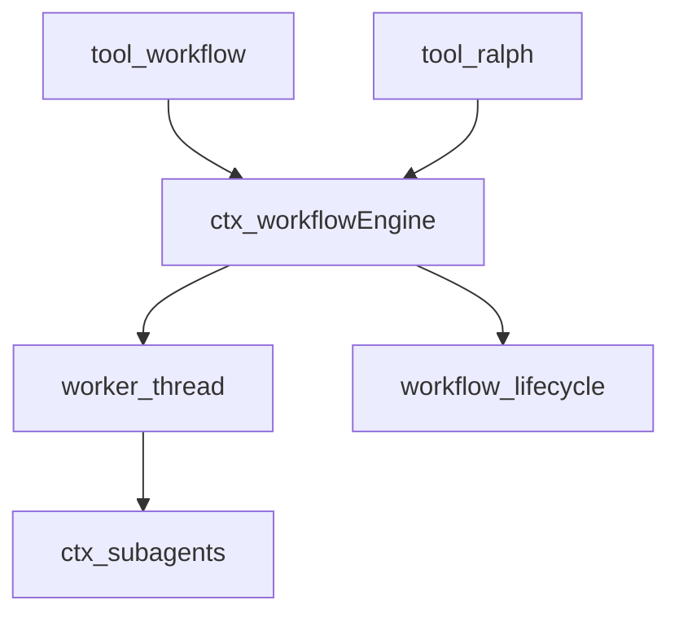
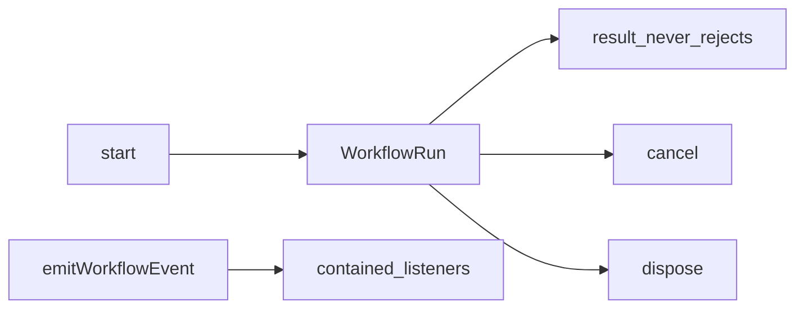
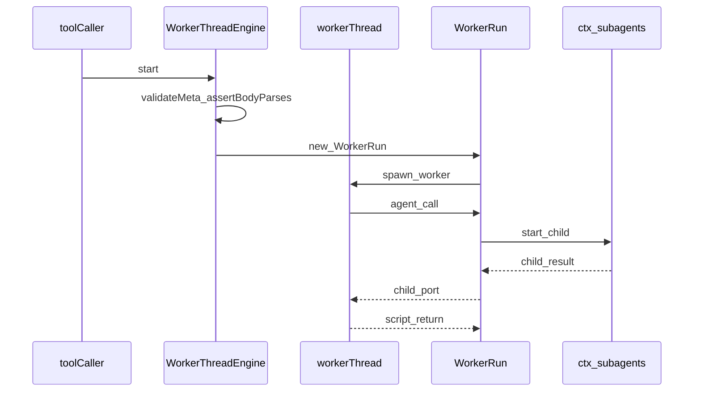
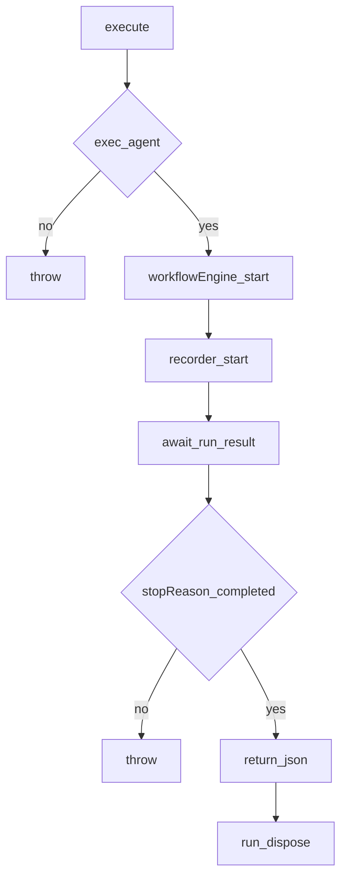
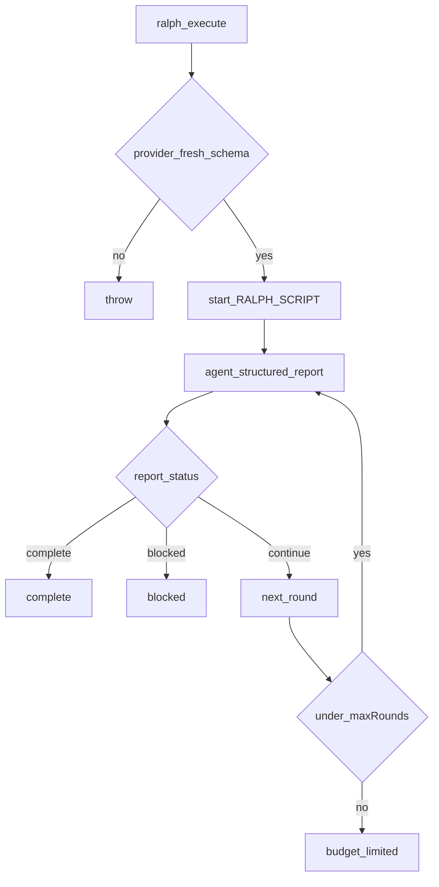

# workflow/ — 编排脚本与 Ralph

学习笔记，非正式产品文档。类型合同见 [workflow.md](../../subsystems/workflow.md)。组映射见 [packages/workflow/README.md](../../../packages/workflow/README.md)。

脚本在 worker 里跑，`agent()` 桥回宿主的 subagent。worker 防同步堵死宿主，也允许强杀，但不是安全边界。

## `@deepseek-ai/dsh-workflow` — 引擎合同

- 角色：Service Definition（抽象）
- ctx：`ctx.workflowEngine`
- 入口：[packages/workflow/workflow/src/index.ts](../../../packages/workflow/workflow/src/index.ts)、[types.ts](../../../packages/workflow/workflow/src/types.ts)、[runtime-types.ts](../../../packages/workflow/workflow/src/runtime-types.ts)
- 关键类型：`WorkflowStartRequest`、`WorkflowRun`、`WorkflowResult`、`WorkflowError`、`WorkflowMeta`
- emit：`workflow/start`、`workflow/phase`、`workflow/log`、`workflow/agent-start`、`workflow/agent-end`、`workflow/end`

实现逻辑：

1. `WorkflowEngine` 占住 `ctx.workflowEngine`；`start` 由 Provider 实现。
2. 非法请求在发表前抛；一旦返回 `WorkflowRun`，失败走 `result.stopReason`，`result` 永不 reject。
3. `WorkflowError` 全是 fatal：`parallel` / `pipeline` 必须再抛，子 agent 普通失败才变成该项 `null`。
4. `emitWorkflowEvent` 包容每个监听器，避免一个观察者拆掉生命周期。
5. `workflow/end` 在 `result` 兑现时发一次，载荷只有 stopReason / error / agentsStarted，不含返回值。
6. 取消与 `dispose` 有界；拆除在界内等子清理。

源码走读：`WorkflowEngine.start`、`WorkflowError`、`isFatalWorkflowError`。观察事件不带 run 控制句柄。

## `@deepseek-ai/dsh-workflow-worker-thread` — worker 引擎

- 角色：Service Provider
- ctx：占住 `ctx.workflowEngine`；`inject: ['subagents']`
- 入口：[packages/workflow/workflow-worker-thread/src/index.ts](../../../packages/workflow/workflow-worker-thread/src/index.ts)、[host.ts](../../../packages/workflow/workflow-worker-thread/src/host.ts)、[worker.ts](../../../packages/workflow/workflow-worker-thread/src/worker.ts)、[meta.ts](../../../packages/workflow/workflow-worker-thread/src/meta.ts)
- 关键类型：`WorkerRun`、`WorkerInit`、`WorkerLimits`
- 配置：`provider` 默认 `spawn`，`maxTotalAgents` 1000，`syncTimeoutMs` / `disposeGraceMs` 各 5s

实现逻辑：

1. `start` 先 `validateMeta`，再用与 worker 相同的 wrapper 做宿主侧 `vm.Script` 解析，保住同步 `SCRIPT_PARSE`。
2. 正文若以 `export const meta` 开头，指向“meta 走请求字段”的明确错误。
3. 解析 `subagentProvider`（覆盖或配置），确认 `ctx.subagents.getProvider` 存在。
4. `maxConcurrentAgents === 0` 时自动 `min(16, max(1, cores-2))`。
5. 在 `start()` 仍被追踪时捕获 `this.ctx.subagents`，避免 HMR 卸掉引擎后 `WorkerRun` 再走失活 fiber。
6. 发 `workflow/start`，`WorkerRun.result` 兑现后再发 `workflow/end`。
7. worker 环境洗掉凭证；Windows 只注入真实 `TMP`/`TEMP`。
8. 取消超过 `disposeGraceMs` 则 force-settle `cancelled` 并 TERMINATE worker。

源码走读：`WorkerThreadWorkflowEngine.start`、`assertBodyParses`、`WorkerRun`。脚本 realm 没有 fs / 网络 / 定时器 / Node API。

## `@deepseek-ai/dsh-tool-workflow` — 模型写脚本

- 角色：Consumer
- ctx：无自有键；`inject: ['tools', 'workflowEngine', 'systemPrompt']`
- 入口：[packages/workflow/tool-workflow/src/index.ts](../../../packages/workflow/tool-workflow/src/index.ts)、[types.ts](../../../packages/workflow/tool-workflow/src/types.ts)
- 工具名：默认 `workflow`（`Config.toolName`）
- 写入：`tool-workflow/run-start`、`agent-start`、`agent-end`、`run-end`

实现逻辑：

1. prompt 段要求：只有用户明确要 workflow / 大规模编排才用；一两下委派走普通 subagent。
2. 工具描述就是模型可见规格：`meta` JSON、`script` 纯 JS、`agent` / `pipeline` / `parallel` / `phase` / `log` / `args`。
3. `execute` 必须有 `exec.agent` 当所有子的 parent。
4. `META_INVALID` / `SCRIPT_PARSE` 同步抛，变成 isError，模型能改。
5. 顶层调用（无 `exec.parent`）才记 session 事件；记录失败只 warn，不拆工具。
6. `exec.signal` abort 调 `run.cancel('parent step aborted')`。
7. 非 `completed` 当工具错误，不报部分输出；`finally` 里 `dispose`。
8. 返回值按 `maxResultChars`（默认 50000）截断 JSON。

源码走读：`createWorkflowRecorder`、`stopReasonError`、`DESCRIPTION`。展示卡标题来自 `meta.name`。

## `@deepseek-ai/dsh-tool-ralph` — 固定新鲜子循环

- 角色：Consumer
- ctx：无自有键；`inject: ['tools', 'workflowEngine', 'subagents', 'systemPrompt']`
- 入口：[packages/workflow/tool-ralph/src/index.ts](../../../packages/workflow/tool-ralph/src/index.ts)
- 工具名：`ralph`
- 配置：`subagentProvider` 默认 `spawn`，`maxRounds` 256，handoff / result 各 16384 字符

实现逻辑：

1. 模型只给 `objective` 与可选 `maxRounds`；循环、schema、校验都是部署写死的 `RALPH_SCRIPT`。
2. `requireFreshProvider`：必须有 `outputSchema`，且 `inheritsParentContext === false`。
3. 每轮新子，不带父对话与上一子 session；工作区当长期记忆，跨轮只传有界 structured report。
4. report 字段：`status` / `summary` / `evidence` / `nextSteps` / `blocker`；`continue` 要有 nextSteps 且 blocker 空；`complete` 要有 evidence、无 nextSteps；`blocked` 要具体 blocker。
5. 宿主再 `readRunResult` 解码，不信任脚本边界。
6. `round-failed`（子返回 `null`）当工具错误，并带上上一份 handoff。
7. 文案写“worker reported”，不当成独立验收。
8. prompt 段：只有人类明确要 Ralph / 新鲜子迭代才用；普通长任务走 goal。

源码走读：`RALPH_SCRIPT`、`requireFreshProvider`、`readRunResult`。`maxTotalAgents` 设成本轮 `maxRounds`。
