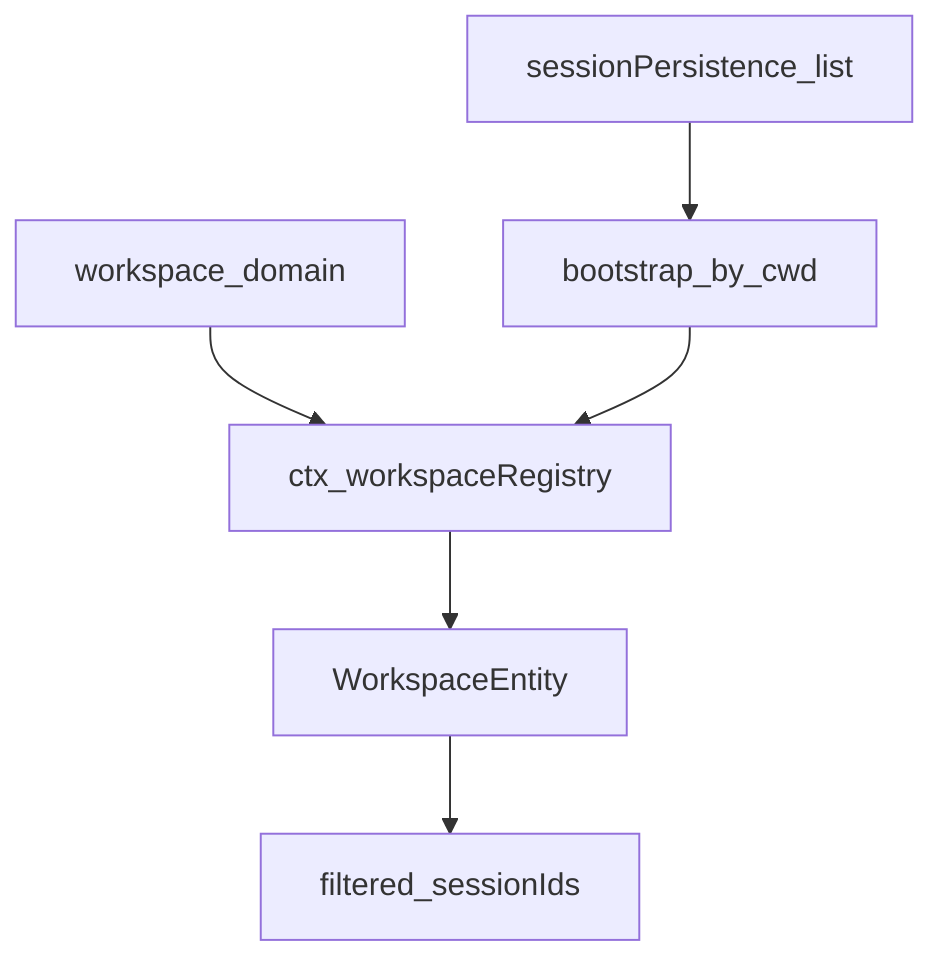
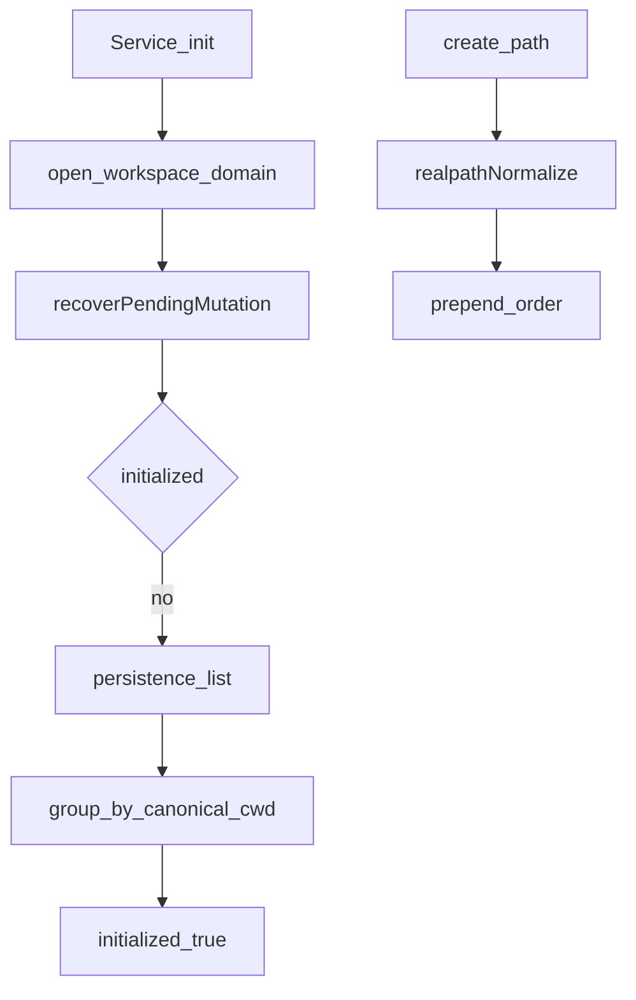

# workspace/ — 工作区实体

学习笔记，非正式产品文档。类型合同见 [workspace.md](../../subsystems/workspace.md)。组映射见 [packages/workspace/README.md](../../../packages/workspace/README.md)。

工作区是带标题和有序 session 成员的用户目录；记录走 [storage-domain](storage.md)，成员资格对照 [session-persistence](session.md) 的 header。

## `@deepseek-ai/dsh-workspace` — 工作区注册表

- 角色：Service
- ctx：`ctx.workspaceRegistry`；`inject: ['storageDomain', 'sessionPersistence']`
- 入口：[packages/workspace/workspace/src/index.ts](../../../packages/workspace/workspace/src/index.ts)、[entity.ts](../../../packages/workspace/workspace/src/entity.ts)、[spec.ts](../../../packages/workspace/workspace/src/spec.ts)
- 关键类型：`Workspace`、`WorkspaceId`、`WorkspaceRecord`、`WorkspaceUnknownSessionError`、`WorkspaceOrderInvalidError`

实现逻辑：

1. `Service.init` 打开 workspace domain；`sessionPersistence` 是硬依赖，避免把不可用误当成空历史并写下 initialized 标记。
2. 未初始化时按规范 cwd 给已存 header 分组，为每个已有目录建记录，再标 `initialized`。
3. `create(path)` 经 `fs.realpath` 规范化；非目录拒绝；同一规范路径复用实体且不改标题。
4. 新工作区插到耐久顺序前面；create/delete 用 `pendingMutation` 标记，启动时只完成该标记点名的那一次突变。
5. `list()` 按耐久顺序同步投影；每个实体的 `sessionIds` 已按 header 索引过滤。
6. `archiveSession` 把 id 藏进全局 archive 集，不改工作区账本，好让取消归档回到原位。
7. `insertBefore` 是 DOM 式重排；`delete` 只摘注册，保留目录和日志。
8. cwd 无法解析、不是目录、或与工作区路径不同的 session 从成员资格里滤掉并 warn。

源码走读：`WorkspaceEntity` 不从包入口重导出；消费者只看见 `Workspace`。每次实体写都走私有 `mutate`，统一盖 `updatedAt` 并修剪无效账本。注册表写串在一条 `operationTail` 上。
