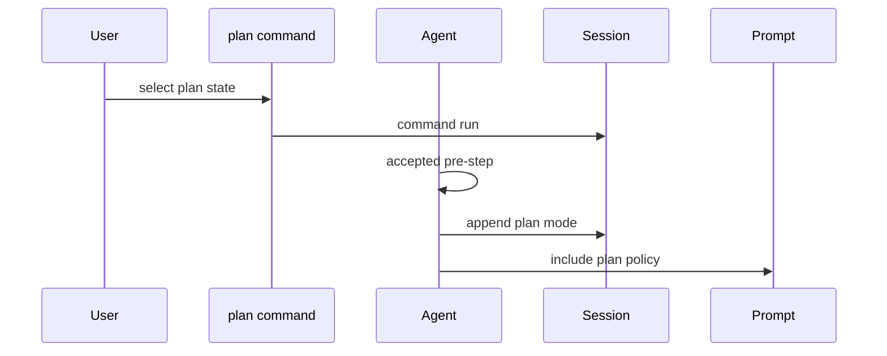

# 目标、计划、待办与人工协作

这些能力不应把 UI 状态当权威：它们依托[会话事件与投影](../data/session.md)和[Agent Loop](../runtime/agent-loop.md)，通过 command/tool、prompt section 或 pre-step 在合适的 durable 边界改变一次 turn。

## Goal 与 Plan

`GoalService`（`ctx.goals`，`packages/goal/goal/src/index.ts`）是同一 session 的 event-sourced objective。它验证 objective、round cap 与 block reason，使用 session log fold/cached activation；create/edit 走 compare-and-set 风格 revision，goal change 写成 `goal/change`，可选 projection registry 再提供 plain JSON `goal` unit。进程内 activation 可 `disarm()`，但不会暗中改 durable phase；round driver 和 `tool-goal` 是运行/模型 consumer。

`PlanModeController`（`ctx.planMode`）把最后一条 `plan/mode` 作为权威。`/plan` 选择先进入 pending，只有下一次已接受的 `agent/pre-step` 才 commit，因此 policy 不能阻止 session state；`plan:policy` 仅在 active 时进 prompt，`exit_plan_mode` 始终注册以稳定工具 catalog，并用 user question 请求审阅。sandbox/approval 独立执行，不能把 plan mode 当安全授权。

图示显示 plan selection 与可见 policy 的 commit 次序。

## 其它协作能力

- `todo/tool-todo` 提供模型侧 `todo_write`；todo 应作为可呈现的协作输出，不能替代 goal 的生命周期或 plan 的用户 review。
- `feedback/message-feedback` 和 `command-feedback` 捕捉显式人类反馈；`interaction/commands` 是不启动模型 turn 的人类命令表面。
- `user-questions`/`tool-ask-user` 与 `user-approval` 分别处理问题和一次性授权。未知答复不得升级为持久 grant。
- `guard/repeat-tool-reminder` 只给 loop hygiene 建议；`timeout-policy` 在 `tools/execute` 强制协作式 deadline。二者都不是工具实现内的隐式 policy。

## 修改与验证

新增协作状态应先选择 durable `SessionEventMap`、fold/projection、Remote/UI consumer 和 tool/command surface，再考虑提示词。验证至少包括 resume/fork、pre-step reject、并发 revision、user cancellation 与 service dispose。

聚焦命令：`pnpm vitest run packages/goal packages/plan packages/todo packages/feedback packages/interaction packages/guard`。