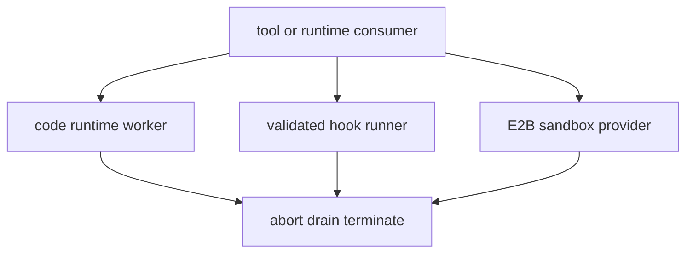

# 代码运行时、Hooks 与 E2B

这三类能力会运行不受 Harness 控制的代码或服务，故 provider 生命周期比一般 tool 更严格。底层本地隔离选择见[Sandbox 与原生 Runner](../platform/sandbox-and-native-runners.md)，通用 process semantics 见[文件系统、Shell、子进程与终端能力](filesystem-and-process-capabilities.md)。

## Code runtime

`packages/code-runtime/code-runtime/src/index.ts` 定义 `ctx.codeRuntime`：consumer 提交 portable binding 与代码，provider 返回可序列化 result；用户程序错误应成为 result 而非让 runtime promise 无约束 reject。`code-runtime-worker-thread` 使用 worker protocol/bootstrap 运行 hostile 程序，拥有 binding 编码、资源预算、in-flight ledger 和线程 teardown。取消或 unload 时停止准入、abort request、等待有限 cleanup 后终止 worker；不得把 host service、secret 环境或不可移植闭包注入 worker。`tool-*`/Code Mode 是 consumer。

## Hooks

`hook-protocol` 定义 Claude Code/Codex bridge 共用的 codec、matcher、merge、runner 和 detached-run contract。hook 配置只能按限制性规则合并，wire input/output 要验证；可审计事实写入 durable session，而不是只打印 stdout。`hooks-claude-code` 和 `hooks-codex` 映射各自兼容协议；外部 command 的 detached work 在 owner dispose 时停止准入并 drain，失败不能绕过父 agent cleanup。

## E2B

`ctx.e2b` 是远程 sandbox seam，`e2b` provider 管理共享 remote sandbox 的创建/复用、deadline、删除与 dispose kill；`fs-e2b` 和 `subprocess-e2b` 把同一远程 execution world 暴露给文件/进程 consumer。凭据只用于 E2B provider 调用，不能隐式转发到 sandbox child；远端消失、超时或取消必须产生有界错误与本地 ledger cleanup。

图示强调每条执行链都有拥有者和同一类收束终点。

## 修改与验证

| 表层 | 完整变更面 | 聚焦验证 |
|---|---|---|
| Code runtime | definition、worker protocol/bootstrap、binding codec、consumer、teardown | `pnpm vitest run packages/code-runtime` |
| Hook bridge | protocol codec/merge、specific bridge mapping、session audit、detached drain | `pnpm vitest run packages/hooks` |
| E2B | seam、fs/subprocess provider、credential boundary、timeout/delete/dispose | `pnpm vitest run packages/e2b` |

在测试中覆盖 malformed wire、worker/remote death、abort race、超时和重复 dispose；不要把实际 API credential 放入 fixture 或诊断。