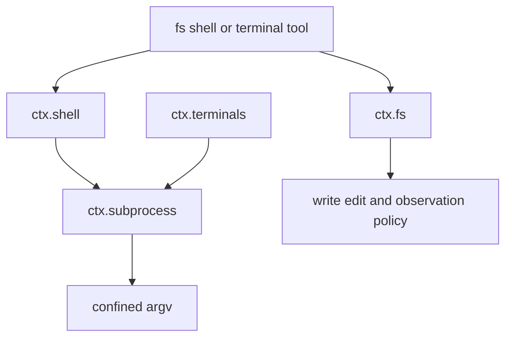

# 文件系统、Shell、子进程与终端能力

这是模型副作用的执行面；审批与工具调度见[工具执行与授权](../runtime/tool-execution-and-authorization.md)，平台隔离见[Sandbox 与原生 Runner](../platform/sandbox-and-native-runners.md)。四个 seam 共享“execution world”而不是相互绕过：文件 target、进程 cwd、可执行文件与 sandbox policy 必须属于同一 provider 世界。

图示为 definition/provider/consumer 链；tool 不能以 Node 原生 I/O 或 `spawn` 绕过它。

## 文件系统

`packages/fs/fs/src/index.ts` 的 `FileSystem` 是 `ctx.fs`。provider 负责 canonical `FsTarget` identity、`processPath()`/`fileUrl()`、containment、UTF-8/binary 语义、稳定目录列表以及原子 mutation；consumer/policy 负责读窗口、观察状态和用户行为。`fs-local` 实现本地 realpath/原子写，`fs-sandbox` 在同一 API 上应用 per-call `SandboxExecutionPolicy`，`tool-fs`、`tool-fs-search`、`tool-str-replace-editor` 是模型消费者。

写入在 `fs/write-intent` waterfall 决策，编辑在 `fs/edit-intent` 决策；第一个 guard 决定意图，随后 provider 在一个临界区检查 version、literal match 并发布。`fs/observed` 记录权威的正/负观察，listener 必须同步。相对路径只依赖明确 cwd；target key 是 opaque，跨 alias 比较使用 provider API。

## Shell、子进程与 PTY

`ShellExecutor`（`ctx.shell`）负责 command 默认值和 foreground/background 语义：非零退出、超时 kill、abort kill 都是结果而不是 reject；background handle 的增量读取不得重复输出，并须由拥有 composition 收束。`bash-local`/`pwsh-local` 是平台 provider，sandbox variants 在启动前请求 confinement，`tool-bash`/`tool-pwsh` 是 consumer。

`SubprocessRuntime`（`ctx.subprocess`）是受管理 process tree seam。`spawn()` 返回 live handle，`done` 在 close 解析，`terminate()` 统一执行 tree-scoped TERM—grace—KILL，`waitForExit()` 是真实 tree quiescence；service dispose 终止并等待所有仍运行的 child。默认 parent env 由 `scrubbedParentEnv()` 去除 credential-shaped 名与 `DSH_*`，只有 spec 显式 env 才可传入。

`TerminalSessionService`（`ctx.terminals`）把可替换 PTY backend 注册为 type，并将会话绑定到精确 live `Agent`。name 在 owner 内保留，spawn 未发布前也可取消；send 是每 session exclusive，foreign owner/no backend/no session 都 fail loud。agent 或 service 关闭时 registry 回收 published session 与 pending spawn，并等待 backend `close()`。

## 变更路线

| 改动 | 完整变更面 | 聚焦验证 |
|---|---|---|
| 新文件 provider/policy | `dsh-fs` definition、provider、tool/observation consumer、bundle 注册 | `pnpm vitest run packages/fs` |
| 新 shell/provider | `dsh-shell`、`dsh-subprocess` 交界、env scrub、tool、sandbox policy | `pnpm vitest run packages/shell packages/subprocess packages/sandbox` |
| PTY backend/工具 | terminal backend registration、owner cleanup、tool consumer、agent teardown | `pnpm vitest run packages/terminal packages/subprocess` |

所有取消路径都应验证：未发布资源回滚、已发布资源停止、输出 reader 结束、dispose 可重复。