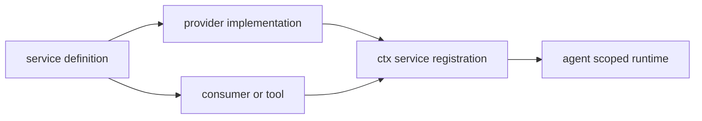

# Capability Seam 与插件扩展模型

DeepSeek Harness 建立在 Cordis：插件通过 `ctx.effect()`、`ctx.on()`、`ctx.waterfall()` 贡献服务和可逆副作用。没有应直接修改的特权内核；正确扩展方式是新增/替换 plugin 行与 service provider。

一个 capability seam 有三种角色：**definition** 声明 service/interface 与类型；**provider** 注册一种实现；**consumer**（常为工具）只依赖 definition。一个包可承担多个角色，但替换 provider 不应要求 consumer import 具体实现。

图示为 packages README 与 `docs/architecture.zh.md` 所采用的 seam 模型。

## 领域地图

| Capability | 主要包 | 规范页面 |
|---|---|---|
| agent/session/prompt/tools | `core/*` | [Agent Loop](../runtime/agent-loop.md)、[会话](../data/session.md)、[工具执行](../runtime/tool-execution-and-authorization.md) |
| LLM | `llm/llm`、`llm-deepseek`、`llm-pi-ai`、retry、token-meter | LLM request/stream contract；改动应读 `docs/subsystems/llm-streaming.zh.md`。 |
| 文件、shell、terminal、subprocess、sandbox | `fs/*`、`shell/*`、`terminal/*`、`subprocess/*`、`sandbox/*` | [工具执行](../runtime/tool-execution-and-authorization.md)、[平台 sandbox](../platform/sandbox-and-native-runners.md) |
| subagent/jobs/schedule/workflow | `subagent/*`、`jobs/*`、`schedule`、`workflow/*` | [异步生命周期](../runtime/async-agents-and-workflows.md) |
| Web/MCP/LSP/skills/code runtime | `web/*`、`mcp-client`、`lsp/*`、`skill/*`、`code-runtime/*` | [MCP](../runtime/mcp-client.md)；其余由包 README 和工具目录负责。 |
| persistence/settings/credentials/storage | `session/*`、`settings/*`、`credentials/*`、`storage/*` | [配置状态](../runtime/configuration-and-state-sources.md)、[持久化查询](../data/session-persistence-and-query.md) |

## 扩展检查表

新增公开 capability 时，同时交付 definition 的 exports/类型、至少一个 provider、consumer import path、组合注册行、模型 schema/提示词影响、取消和 teardown、以及最窄 consumer-facing test。若新增模型可见数据，另遵守 session event 规则。包的全量领域归属在[包领域索引](../reference/package-domains.md)。