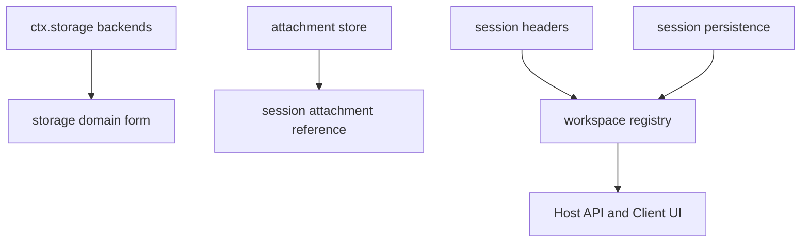

# Storage、附件与工作区注册表

会话日志不是所有持久数据的容器。本页的三条数据线各有 seam：`ctx.storage` 存非 session domain 数据，附件将 content 与 session reference 分离，`ctx.workspaces` 则从 persistence/session headers 恢复可用 workspace。

图示呈现 ownership，而非把附件内容或 workspace 元数据塞入 session event。

## Storage 与附件

`packages/storage/storage/src/index.ts` 的 `StorageRuntime` 注册可并存 backend；`storage-json` 与 `storage-sqlite` 是 provider，`storage-domain` 将一个 domain form 挂载到该 runtime。backend/name 注册与 disposer 都由 Cordis effect 所有；transaction、并发和 schema/migration 由具体 backend/domain 表达，consumer 不应直接打开 provider 私有文件。

`dsh-attachment` 定义 attachment identity、metadata、验证与引用；`attachment-local` 用内容寻址 store。附件必须在 session event 添加引用**之前**完成验证并 durable commit；读取时再次校验引用/内容完整性。session 只保存 id/metadata reference，不能内联大 blob 或假设本地路径永远有效。取消、限额、损坏、原子发布和私有权限是 provider 的失败边界。

## Workspace registry

`packages/workspace/workspace/src/index.ts` 的 workspace service 建立 workspace entity，并在 `storageDomain` 与 `sessionPersistence` 已可用时 bootstrap。它从持久记录和 session header 恢复，序列化 registry mutation、处理 pending mutation，并以 canonical path 判断相同 workspace；因此 Host API、remote、Client workspace UI 应消费 registry view，而不是自行从 cwd 字符串推断身份。迁移/恢复失败需显式暴露，不能把半完成 mutation 当作空 registry。

## 修改与验证

| 改动 | 需要跟随的边界 | 聚焦验证 |
|---|---|---|
| storage backend/domain | registry、backend transaction/migration、form consumer、dispose | `pnpm vitest run packages/storage` |
| attachment format/store | definition、local commit/read validation、session reference consumer | `pnpm vitest run packages/attachment packages/core/session` |
| workspace lifecycle | entity/spec/path canonicalization、storage/persistence bootstrap、Host/Client consumer | `pnpm vitest run packages/workspace packages/host packages/client` |

任何恢复/迁移改动都要覆盖中断写入、竞争 mutation、重启 bootstrap 和无效持久记录。