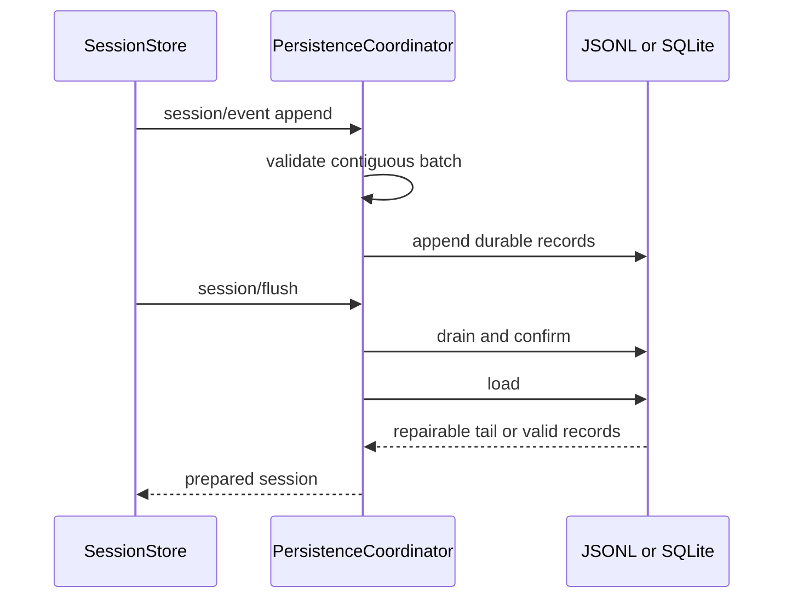

# 会话持久化、恢复、查询与导出

核心日志模型在[会话事件与投影](session.md)；本页定义 provider 对磁盘数据的责任。`dsh-session-persistence` 是 seam，`session-persistence-jsonl` 与 `session-persistence-sqlite` 是后端；不得让业务插件直接解释私有存储行。

## JSONL 协调与恢复

`packages/session/session-persistence-jsonl/src/index.ts` 的 `PersistenceCoordinator` 协调 create、append、prepare、load、read 与 close。默认格式支持 checksummed Zstandard、可选 packed chunks 和 prepared-session cache；固定批写窗口在吞吐与 crash 边界之间取舍。

图示表达 append/flush/load 的耐久协议。格式拒绝、sequence 连续性、checksum/压缩解码失败与 torn tail 的处理必须 fail loud 或按明确 repair 规则截断；不可把损坏当成空会话。Windows 原子发布细节在 `win32.ts`。

## 派生数据与检索

- `session-projection` 定义纯 projection；`session-projection-cache` 缓存其切面，失效依据日志修订/事件而非 UI 猜测。
- `session-checkpoint-policy` 决定何时持久 checkpoint，不改变原始事件事实。
- `session-query` 定义有界读取、血缘、关系和语义过滤；`session-query-sqlite` 提供全文检索索引；`session-log-export` 只导出可由日志重建的内容。
- `attachment`/`attachment-local` 所有内容寻址附件；session 仅持久标识与元数据引用，读取必须验证 attachment store。
- 非会话 `storage-json`/`storage-sqlite` 属于 `storage` domain，不能替代 session persistence。

## Write-behind 的批处理与 flush barrier

`packages/session/session-persistence/src/write-behind.ts` 的 `SessionWriteBehind` 是后端之前的顺序器。`enqueue()` 先复制 event；首个 pending event 固定一个 batch deadline，后续 event 只加入该窗口、不能延长它。deadline 到来若 active write 仍在运行，则标记 `deadlineExpired`；active 写完成后立即启动超过预算的 tail，而不是丢弃或把它并进已提交 batch。

并发 `flush()` 共享一个显式 barrier。`drainBarrier()` 等待与其重叠的 write，再持续 drain 已纳入 barrier 的 tail 至 quiescence；flush 期间新事件按 admission 边界进入后续窗口，不会使既有 barrier 无限等待。durable write 失败时，失败 batch 以前缀顺序回插，automatic path 暂停并报告 background failure；后续 flush 在该失败未被处理时明确拒绝，不能假称持久化成功。

聚焦证据：`packages/session/session-persistence/tests/write-behind.spec.ts` 固定窗口、并发 barrier、quiescent barrier 后的新窗口、over-budget tail 与失败回插时序。

## 修改与验证

修改 format、migration、batch、恢复或查询 index 时：读 `format.ts` 与 `tests/jsonl.spec.ts`、`zstd.spec.ts`、SQLite persistence/query tests；覆盖压缩兼容、损坏尾、被中断轮次、并发/连续 append、flush/close。聚焦命令：`pnpm vitest run packages/session/session-persistence-jsonl packages/session/session-persistence-sqlite packages/session/session-persistence packages/session-query`。