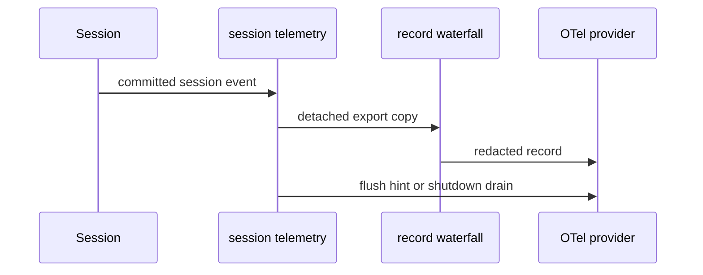

# 会话遥测、脱敏与关闭

`session-telemetry` 不拥有 agent 真相；它从[会话事件与投影](session.md)捕获 canonical event，再交给 batching/export provider。因而 exporter 的失败不可影响 Agent Loop 或日志 durability，且所有外发 copy 都必须经过脱敏边界。

图示表示捕获热路径与外发路径分离：持久 session event 不被 telemetry listener 改写。

## 契约

`packages/session/session-telemetry/src/index.ts` 声明 `session-telemetry/record` fail-closed redaction waterfall。它操作 detached exported copy；listener 必须显式交付可分享记录，不能使原 session event、错误对象或 credential 值外泄。coordinator 负责 canonical capture、replay/error 归类、turn flush hint 与关闭标志；热路径 emit 不等待网络。

`session-telemetry-otel` 是 downstream provider：其 OTel mode 默认 disabled，provider 负责 batching、retry/loss policy 和有界 exporter shutdown。sharing disclosure 属于记录的可见契约，不能由某个 dashboard 或 browser consumer 暗中决定。`DSH_TELEMETRY_DISABLED` 在 launcher 组合层增加禁用 patch；它是 composition 开关，不是绕开 redaction 的理由。feedback 可关联行为事实，但不应成为绕过 telemetry 记录/脱敏的平行外发通道。

## capture 一致性边界

live mode 在构造时监听 session/agent，并收养已有 session；on-demand mode 不订阅热事件，只在 `captureSession()` 从 canonical log 读取。每个 session 的 `handoffCursor` 记录已被 backend **接收**的前缀：首次 capture 从起点开始，重收养不会重复已交付事件；redaction 或 backend 对某事件失败时 cursor 不前进，因此后续 capture 仍可按定义重试。每个 `(turn, step)` 最多输出第一条 `assistant/chunk`；被投影丢弃的 chunk 同样不前进 cursor，避免无记录地越过它。

`captureEvent()` 对 body 做 `structuredClone`，附加 session/agent identity attributes，并在 capture 时运行 redaction waterfall。脱敏规则或 backend 的异常按单事件 fail-closed：该 event 不外发，但不会冒泡到 Agent Loop，也不阻塞以后 event。session dispose 解除收养；turn flush hint 只促使 provider flush；`agent/error` 走同一隔离 relay。app teardown 先停止接纳，再有界 drain/backend shutdown；shutdown 失败被记录为诊断而非重新打开 agent 工作。

## 修改与验证

新增 telemetry 字段时先确认其从 canonical session 事实可得、export copy 是否最小化、redaction listener 能拒绝它、OTel schema 是否兼容。验证 live/on-demand capture、handoff、chunk 投影、redaction 拒绝、队列 overflow/失败隔离、flush、shutdown timeout 与重复关闭。

聚焦命令：`pnpm vitest run packages/session/session-telemetry packages/session/session-telemetry-otel`；`packages/session/session-telemetry/tests/telemetry.spec.ts` 是深拷贝、未知事件、严重级别和每 step 首 chunk 的 focused 证据。