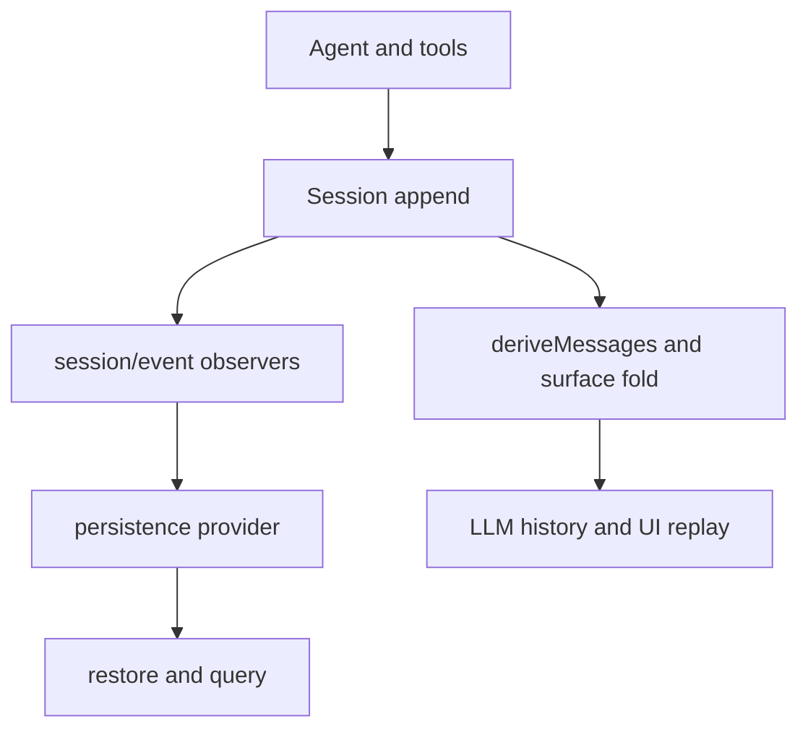

# 会话事件、投影与可回放状态

`packages/core/session/src/index.ts` 的 `SessionStore` 是 `ctx.sessions`。它保存带 header 的会话及 append-only `SessionEvent` 日志；持久化不是 core 的直接职责，而是订阅 `session/event`、在 `session/flush` 完成 durability 的 provider concern。

图示展示一条事件流同时驱动运行时投影与耐久边界。

## 不变量

- header 版本必须等于 `SESSION_FORMAT_VERSION`，id、时间、绝对 `cwd` 等字段受验证并冻结。
- 事件跨导入边界必须经 `snapshotSessionEvent()` 深拷贝、验证并冻结；仅在独占所有权时可用 `adoptSessionEvent()`。
- `session/created` 的同步 throw 可 veto 并回滚；`session/event` 是 post-commit、观察者失败被包含；`session/flush` 则等待所有 durability listener。
- 模型可见即已记录：新增模型上下文必须扩展 `SessionEventMap`、渲染/投影，而不能只写实时事件。

`surface.ts` 折叠 append/replacement surface event；`deriveMessages()` 将日志投影为模型历史。会话 fork、transcript、标题、遥测、attachment 引用和客户端显示均从此边界派生。格式与 provider 细节见[会话持久化与查询](session-persistence-and-query.md)。

验证：改 event schema、repair 或 projection 时运行 `pnpm vitest run packages/core/session packages/session`。