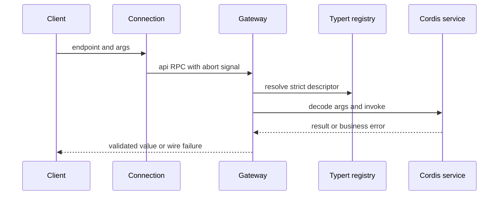

# Typert、Gateway 与 Connection

Typert 将 Host Cordis service 上的 Remote 方法投影给 Client。`packages/typert/generator` 分析 Host 类型；`loader`、`protocol`、`registry` 提供生成物加载、描述符与运行时注册表。`api/remotes` 组装业务 BFF；`api/gateway` 不拥有业务策略，只分发调用。

## Gateway 边界

`TypertGatewayService` 在 `packages/api/gateway/src/index.ts` 注册 Connection RPC 的 `/api` interceptor，authority 为 `trusted-host`。endpoint 必须为 `namespace/method`；payload 必须只含 plain object `args`。

图示为 `/api` 的 Host authority 边界。

Gateway 先使用 strict generated descriptor；如果 endpoint 曾有 strict 定义而后被撤回，禁止 SRC fallback。未见过的 endpoint 才可从 active service 的 `typertRemote` marker 构造保守 SRC descriptor。它校验精确参数名、lookup/context receiver、取消参数位置和结果 codec；service 缺失、方法缺失、签名歧义、无效 payload 都转为 `TypertGatewayError`。业务错误保持其身份；carrier 取消与业务 reject 竞争时变为取消边界错误。

## 变更面与验证

新增 Remote 需要：Host service `@Remote`/`@RemoteScope`、可生成的 types/JSDoc、Typert registry/generator surface、`api-remotes` contribution、Client import/namespace consumer，以及跨 Gateway 的测试。不要让 Client 直接 import Host implementation。

生成/校验命令：`pnpm run gen-cordis-api`、`pnpm run verify-cordis-api`、`pnpm run typecheck`；改生成图时也使用 `pnpm run gen-module-graph`/verify。运行 `pnpm vitest run packages/api packages/typert packages/client/connection`。自动化 stdio 协议另见[自动化 SDK](automation-sdks.md)。