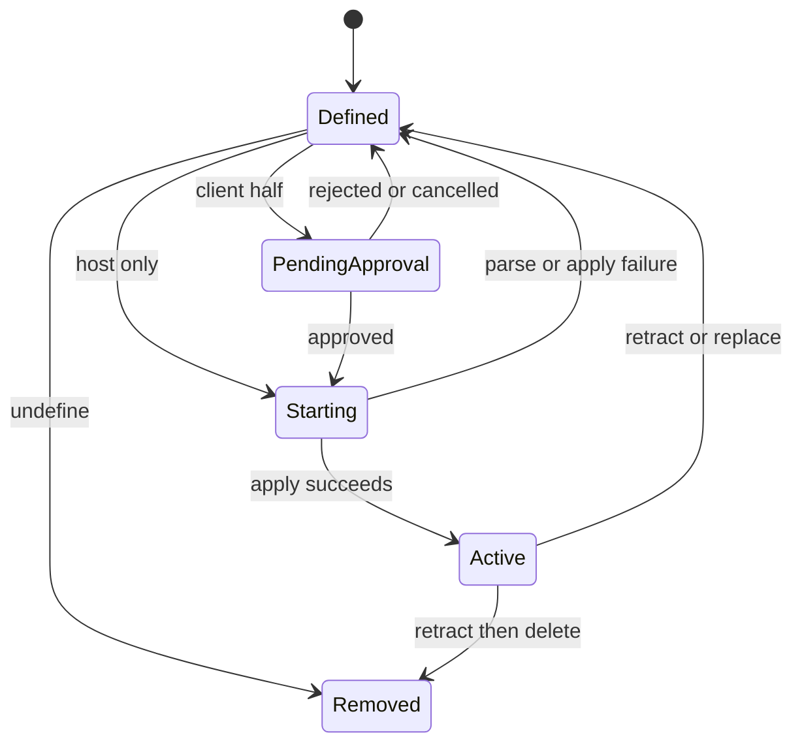

# 动态 Cordis Plugin 的 VM 隔离与生命周期

`packages/extensions/cordis-host-runner` 是动态代码的安全边界，独立于 OS 进程 sandbox。`DynamicCordisRunnerService`（`ctx.dynamicCordisRunner`）拥有不可变 Package definitions、每 Plugin 至多一个 active run、Host/Client activation 和 Remote panel control；`cordis-client-runner` 与 `tool-cordis` 是相邻 consumer。

## 定义、审批与撤销

`define()` 需要非空 name/purpose、Host 或 Client source，并先 `precheckCode()`；新 Plugin 由 Host mint id 且归属 session。Host-only package 可直接激活；带 Client half 的首次版本需人类 approval，Plugin-wide approval 可覆盖后续版本。`undefine()` 先取消 pending request，再 retract active run，最后删除 registry；因此 package/version 变更不能遗留旧 fiber。

图示表达 registry 对 activation 的线性化与回滚。

## VM contract

`createSandbox()`、`evaluateHostCode()` 与 `precheckCode()` 提供受限 VM：动态代码没有 `process`、`Buffer`、`require`、原生 timer 或 `fetch`；它应通过显式 Cordis services/动态工具声明获得能力。跨 realm value 必须经过 guard/normalization，不能信任 prototype。`vmTimeoutMs` 默认 5000，限制同步 evaluation；异步 handler 仍需通过 Cordis 生命周期自行收束。解析、evaluate、apply 或 handler 失败都必须撤销已创建 run/handler，不留下活跃实例。

重点证据：`tests/sandbox.spec.ts`（Node API trap、服务替代、VM 时限、失败 cleanup）、`sandbox-context.spec.ts`、`runner.spec.ts`、`composition.spec.ts`、`versioning.spec.ts`。改动后运行 `pnpm vitest run packages/extensions/cordis-host-runner`。