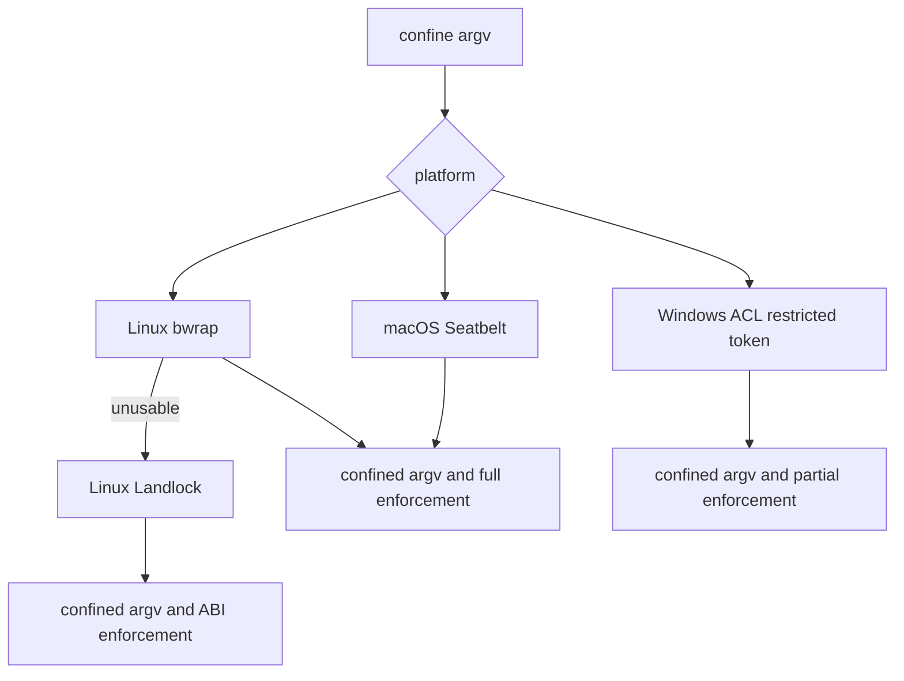

# Sandbox 与原生 Runner

`packages/sandbox/sandbox-local/src/index.ts` 是 `ctx.sandbox` 的本地 provider，不是 Landlock-only 实现。它将 shell/subprocess consumer 的 argv 包装为 `ConfinedArgv`，返回 enforcement 与 stderr 分类事实；不可用 confinement 必须 fail closed，绝不返回原 argv。

图示为 `PLATFORM_CHAINS` 的选择逻辑。Linux 优先功能探测 bwrap 后降至 Landlock；macOS 使用 Seatbelt；Windows 使用 ACL restricted-token runner。runner command override 必须同时配置 failure signatures。probe timeout 必为正有限数，runner 启动/拒绝 profile/command denial 依据明确 stderr/exit 分类，不得模糊为业务失败。

## Windows 的特殊所有权

Windows 以 canonical workspace path 派生 standing workspace write SID，并为每个 live session/workspace 对创建随机私有 temp directory + temp write SID。workspace ACE 可跨 session 复用；temp grant 在 provider dispose 时 revoke。它报告 `partial`：`WRITE_RESTRICTED` 的 Everyone 限制和 NTFS hard link 别名使绝对文件效果保证不成立。不要把 partial 写成 full。

## Landlock native

`native/landlock-run` 是独立 workspace，提供 `@deepseek-ai/node-addon-landlock-run` launcher/prebuild；它有自己的 `build:native`、test、assemble-prebuilds、verify、pack、publish、packed-install 命令。其发布流程与 npm dsh family 相邻但独立，完整闭包见[发布制品](../engineering/release-artifacts-and-generated-contracts.md)。

工具审批/FS/shell 的上游调用见[工具执行与授权](../runtime/tool-execution-and-authorization.md)。重点测试含 sandbox-local 的 `acl-grants.spec.ts`、`bwrap.e2e.ts`、`landlock.e2e.ts`、`seatbelt.e2e.ts`、`packed-install.e2e.ts`，以及 native `test/`。