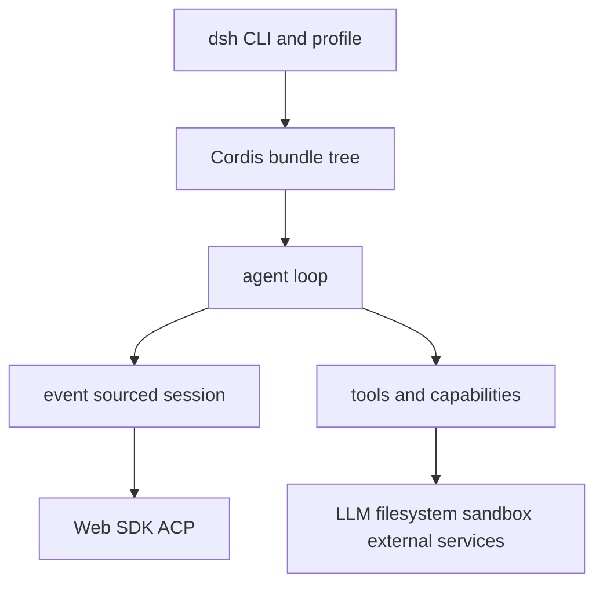

# DeepSeek Harness 代码 Wiki

DeepSeek Harness（`dsh`）是以 Cordis 为底座的插件化 agent harness。运行产品不是固定内核：CLI 解析 profile，按 patch 组装 plugin tree；agent loop 把输入、LLM、工具与可回放 session event 串起来；Web、SDK 与 ACP 都是该运行时的不同 surface。

图示为代码库的主要运行时关系；具体组合顺序见[启动与 Profile](runtime/boot.md)。

## 阅读地图

- **启动、预设与用户状态**：[启动与 Profile](runtime/boot.md)、[配置与状态来源](runtime/configuration-and-state-sources.md)、[Agent Preset](runtime/agent-presets.md)。理解 `dsh --profile`、bundle/patch 覆盖、`DSH_HOME`、settings、credentials 与 session 级组合时从这里开始。
- **核心执行、模型与数据**：[Agent Loop](runtime/agent-loop.md)、[LLM、提示词与运行时上下文](runtime/llm-and-context.md)、[工具执行与授权](runtime/tool-execution-and-authorization.md)、[会话事件](data/session.md)、[会话持久化与查询](data/session-persistence-and-query.md)、[数据资产](data/assets-and-workspaces.md)、[会话遥测](data/session-telemetry.md)。
- **异步、协作与外部工具**：[子 Agent、任务与工作流](runtime/async-agents-and-workflows.md)、[目标、计划、待办与人工协作](capabilities/collaboration-and-agent-guidance.md)、[MCP Client](runtime/mcp-client.md)、[外部工具](capabilities/external-tools.md)、[外部执行 runtime](capabilities/executable-and-remote-runtimes.md)。
- **产品与 API**：[Web 应用](web/application.md)、[Client Runtime](web/client-runtime-and-connection.md)、[Typert Gateway 与 Connection](integration/typert-gateway-and-connection.md)、[ACP、TypeScript SDK 与 Python SDK](integration/automation-sdks.md)。
- **扩展与平台安全**：[Capability Seam](capabilities/seams.md)、[文件系统、Shell、子进程与终端](capabilities/filesystem-and-process-capabilities.md)、[Sandbox 与原生 Runner](platform/sandbox-and-native-runners.md)、[动态 Cordis Plugin 隔离](platform/dynamic-cordis-plugin-isolation.md)。
- **工程与导航**：[构建、测试与门禁](engineering/build-and-test.md)、[发布制品与生成契约](engineering/release-artifacts-and-generated-contracts.md)、[包领域索引](reference/package-domains.md)。

## 按任务路由

| 目标 | 先读 | 关键源码入口 | 聚焦验证 |
|---|---|---|---|
| 新增/调整 profile、bundle 或 CLI flag | [启动](runtime/boot.md) | `apps/cli/src/bin.ts`、`profile-boot.ts`、`packages/boot/app-boot/src/profile.ts` | `pnpm vitest run apps/cli packages/boot` |
| 改 agent turn、流式结果或并发工具 | [Agent Loop](runtime/agent-loop.md) | `packages/core/agent-loop/src/agent.ts`、`tool-calls.ts` | `pnpm vitest run packages/core/agent-loop` |
| 新增 LLM provider、prompt 或 workspace instructions | [LLM 与上下文](runtime/llm-and-context.md) | `packages/llm/llm/src/index.ts`、`packages/core/system-prompt/src/index.ts` | `pnpm vitest run packages/llm packages/core/system-prompt packages/context` |
| 新增工具或改变审批/timeout/sandbox 行为 | [工具执行](runtime/tool-execution-and-authorization.md) | `packages/core/tools/src/index.ts`、provider/tool package | `pnpm vitest run packages/core/tools packages/sandbox` |
| 改文件、Shell、子进程或 PTY 语义 | [文件与进程能力](capabilities/filesystem-and-process-capabilities.md) | `packages/fs/fs/src/index.ts`、`packages/subprocess/subprocess/src/index.ts` | `pnpm vitest run packages/fs packages/shell packages/subprocess packages/terminal` |
| 改 session schema、持久化或检索 | [会话](data/session.md)、[持久化查询](data/session-persistence-and-query.md) | `packages/core/session/src`、`packages/session/*` | `pnpm vitest run packages/core/session packages/session` |
| 改附件、通用存储或 workspace 恢复 | [数据资产](data/assets-and-workspaces.md) | `packages/storage`、`packages/attachment`、`packages/workspace` | `pnpm vitest run packages/storage packages/attachment packages/workspace` |
| 改 Web UI、Host route 或 Remote API | [Web](web/application.md)、[Client Runtime](web/client-runtime-and-connection.md)、[Typert](integration/typert-gateway-and-connection.md) | `apps/web/src/main.ts`、`packages/client/runtime/src`、`packages/api/gateway/src/index.ts` | `pnpm run test:web:built` 或相关 package Vitest |
| 接入外部 MCP server | [MCP](runtime/mcp-client.md) | `packages/mcp/mcp-client/src/index.ts` | `pnpm vitest run packages/mcp/mcp-client` |
| 改 workflow/subagent 取消或清理 | [异步生命周期](runtime/async-agents-and-workflows.md) | `packages/workflow/workflow-worker-thread/src/host.ts` | `pnpm vitest run packages/workflow packages/subagent` |
| 改 goal、plan、todo 或人工交互 | [协作能力](capabilities/collaboration-and-agent-guidance.md) | `packages/goal/goal/src/index.ts`、`packages/plan/plan-mode/src/index.ts` | `pnpm vitest run packages/goal packages/plan packages/interaction` |
| 改 Web/LSP/skill provider 或 code/hook/E2B runtime | [外部工具](capabilities/external-tools.md)、[外部执行 runtime](capabilities/executable-and-remote-runtimes.md) | 相应 `packages/web`、`lsp`、`skill`、`code-runtime`、`hooks`、`e2b` | `pnpm vitest run <对应目录>` |
| 改跨平台隔离或 native runner | [Sandbox runner](platform/sandbox-and-native-runners.md) | `packages/sandbox/sandbox-local/src/index.ts`、`native/landlock-run` | sandbox focused tests + native test |
| 改动态自修改 plugin | [动态 Plugin 隔离](platform/dynamic-cordis-plugin-isolation.md) | `packages/extensions/cordis-host-runner/src` | `pnpm vitest run packages/extensions/cordis-host-runner` |
| 改 exports、代码生成或发布 | [发布制品](engineering/release-artifacts-and-generated-contracts.md) | `scripts/`、manifest、generator | 相应 `gen-*`/`verify-*` + `pnpm run typecheck` |

## 全局不变量

1. **模型可见即已记录**：模型输入的持久事实必须从 `SessionEvent` 重建。
2. **provider 可替换**：consumer 依赖 seam definition，不能硬依赖具体 provider。
3. **取消必须收束**：工具、worker、subagent、MCP 和动态 plugin 都需停止准入、清理 owned resources。
4. **安全边界 fail closed**：缺少可用 sandbox、无效 credentials 文档或不明确 Remote 调用不能静默降级。
5. **Host/Client 编译面分离**：不要将两个 aggregate 合并或把普通包登记到两侧。

## Backlog

无：本轮已为 manifest-backed 产品面、主要 capability 域、LLM/context、数据资产/遥测、预设、浏览器 runtime、协议面、原生与发布面建立 canonical home。