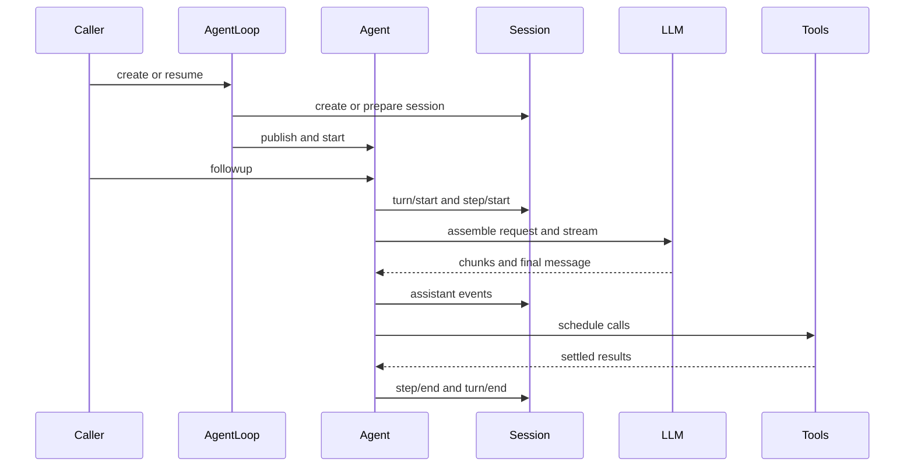

# Agent Loop、轮次与步骤

`packages/core/agent-loop/src/index.ts` 的 `AgentLoop` 是 `ctx.agentLoop` 的具体 `AgentFactory`；它注入 `agents`、`sessions`、`llm`、`tools`、`systemPrompt`。`ReactLoopAgent`（`agent.ts`）驱动每个 agent。抽象 Agent API 在 `packages/core/agent`，因此 UI、ACP、SDK 等消费者不得依赖具体 loop。

## 生命周期与持久边界

图示表达持久 `session/event` 与实时 agent/tool seam 的分工。

轮次在领取第一项工作时开启；步骤是一轮中的一次模型请求及其工具调用。`agent/pre-step`、`agent/request`、`llm/stream` 和 `tools/*` 为 waterfall：监听器必须 `next()` 才委托下游。`agent/turn-stopping` 为 serial checkpoint。首次消息被 pre-step 拒绝或改为空仍留下一个无步骤 turn，记录该次尝试。

模型可见内容必须可从会话日志重建；新增模型可见输入需要扩展 `SessionEventMap` 并实现历史投影，不能只存活在内存或 agent event。完整数据规则见[会话事件与投影](../data/session.md)。

## Inbox、取消与稳定空闲

`ReactLoopAgent.followup(input)` 写入 `next-turn` 并 wake；`steer(input)` 写入 `next-step` 并 wake；`inject(input)` 也写入 `next-step`，但**不** wake，因此只在已有/后续 admitted request 时成为上下文。会唤醒的用户输入与只等待下一请求的注入上下文不能混同。`cancel()` 默认清空未 claim inbox 与 wake latch，再 abort active activity；`keepInbox: true` 仅保留尚未 claim 的队列，不能复活已 abort 的 activity 或已 claim message。活动已 abort 而尚未收敛 idle 时新 waking input 会改投 `next-turn`，避免写进即将失败的当前 turn。

`wakeRequested` 是收敛闩锁：driver 仍在运行/maintenance 时只记录一次，结束后重放；默认 cancel 会清除它，避免被取消的工作意外重启。maintenance 期间不并发启动 driver，结束时再检查 pending wake。`whenIdle()` 观察 activity epoch，循环等待当前 promise 后重读，因而不会在新 activity 替换旧 promise 时错误返回。重点测试 `packages/core/agent-loop/tests/cancel.spec.ts` 覆盖 idle cancel、已 claim 输入、abort 后保留队列、abort-to-idle latch 与清除 latch。

## 创建、配置与关闭

`AgentLoop.Config` 的 `agents` 可在装载时 fresh create 或 resume；`sessionId` 与 `resumeSessionId` 互斥，且精确 identity 不得重复。launcher 能通过 `configuredAgentIdentities` 在 Loader 之前固定身份，防止 patch 改模型路由时丢失会话选择。

`maxParallelToolCalls` 必须为正整数；settings 更改只影响下一组调度，不能扰动在飞组。FactoryOwnership 跟踪启动任务和 live agent teardown；fiber unload 会 abort 创建、等待已追踪工作并依序停止/注销 agent。

## 安全修改

- 改轮次、恢复、inbox 或错误语义：读 `packages/core/agent-loop/src/agent.ts`、`tool-calls.ts` 与同目录 tests；至少验证取消、pre-step 拒绝和 request failure。
- 改工具排序/授权：转到[工具执行与授权](tool-execution-and-authorization.md)，不要在 loop 中复制 policy。
- 改跨进程调用方：ACP/SDK 只消费稳定 Agent/Session 表面，见[自动化 SDK](../integration/automation-sdks.md)。

聚焦命令：`pnpm vitest run packages/core/agent-loop packages/core/agent`。