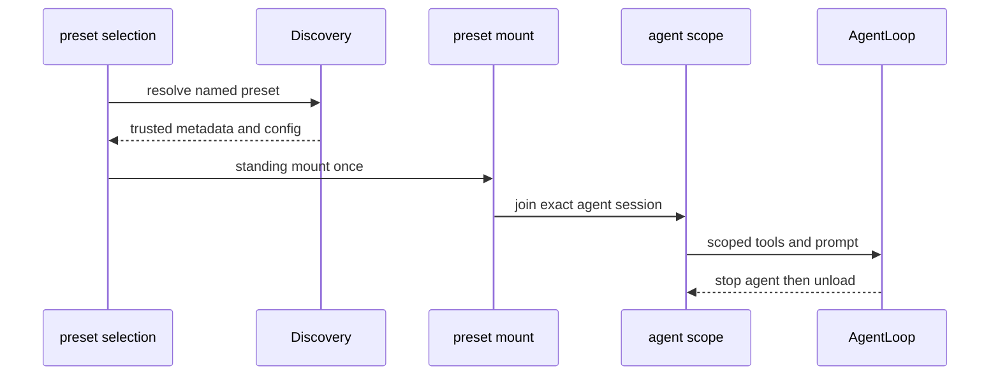

# Agent Preset、Persona 与作用域组合

`packages/preset/agent-presets` 不只是用户设置：一个 preset 是 session 级 Cordis composition。它可以改变 persona、工具、prompt provider、projection 与子 agent 行为，因此必须在[Agent Loop](agent-loop.md)创建/恢复边界选择，且不允许把服务泄漏到 root realm。

图示为 standing composition 与每 agent scope 的不同生命周期。

## 发现、信任与选择

`scanRoot()` 将每个候选 preset 目录做成 roster row；composition 缺失、不能加载、metadata 读取失败或验证失败都保留为 broken row，而非静默跳过，因此 UI/API 可以诊断同名配置。composition YAML 先经 schema 和浅层 entry shape 校验；root 缺失与 root 不可读是不同诊断，扫描结果按确定性规则排序。`discoverPresets()` 再按配置 root 顺序 first-root-wins 合并同 id，先出现 root 的 trust 也随 row 继承。system 与 user root 有不同 trust/authoring 规则；persona 包提供 deployment prompt 槽，preset authoring 需要遵循该 trust 判定。settings 只提供默认/选择信息，不能把未受信路径提升为 system preset。

Host/API 的 preset selection 只允许 blank session：已有 durable history 的 session 不可用切换配置重解释历史。选择结果需与 session header/agent creation 一起记录，恢复时读取同一选择；subagent 创建者应明确继承或覆盖 preset，不可偶然继承 ambient root context。

## Mount、scope 与回滚

一个 preset composition standing-mount 一次，多个 agent 通过 scope parent 加入。`PresetTree.import()` 只按预设树解析：相对路径相对 composition，`cordis:` 走 Cordis builtin，裸包名走预设可见 package resolution；绝对文件路径（包括 Windows 形式）按显式文件边界处理，不能逃逸为任意 ambient import。`PresetTree.write()` 被禁用，避免 Loader teardown 写回预设输入。mount 强制 session isolation；`leakedServices` 审计 root realm service，任何泄漏都失败。创建前的 composition/validation 失败必须 rollback，卸载时先停止加入/创建，再依次释放 agent scopes；一个 session 的释放不影响其他 session 的 standing mount。scoped `systemPrompt`、tools 和 session projection 随 agent scope 生灭，这也是 UI/Remote 只能读取其投影而不能直接依赖 preset implementation 的原因。

## 修改与验证

变更 preset schema、discovery、persona 或 scope 时检查 authoring/export、discovery root/trust、settings/default selection、Host API consumer、agent-loop/subagent consumer、bundle 注册与 mount disposer。重点断言 duplicate/invalid preset、blank-session gate、mount failure rollback、session tool/prompt isolation、子 agent 继承和一方卸载不影响另一 session。

聚焦证据：`packages/preset/agent-presets/tests/discovery.spec.ts` 覆盖 roster/broken、root、排序、precedence/trust；`tests/mount.spec.ts` 覆盖 module resolution、禁止 write、泄漏审计、每 session tool/prompt 隔离、同 preset 并发使用与单 session 卸载隔离。

聚焦命令：`pnpm vitest run packages/preset packages/core/agent-loop packages/subagent packages/host`。