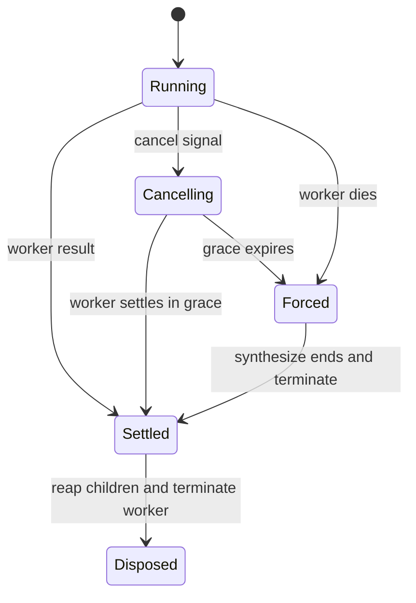

# 子 Agent、任务与工作流生命周期

异步域不能只「发起」工作：每个入口必须定义谁拥有 handle、如何取消、何时停止接受新工作、以及最大等待后如何清理。共同的 agent 语义来自[Agent Loop](agent-loop.md)。

## Workflow worker 的强制收束

`packages/workflow/workflow-worker-thread/src/host.ts` 的 `WorkerRun` 同时拥有 Worker、pending provider starts、已发布 child subagent ledger、取消 signal 与最终 `result`。结果永不 reject；首个 worker result、异常死亡或取消 grace 到期竞争获得终止权。

图示为 `WorkerRun.cancel()`/`dispose()` 的拥有关系。取消会停止消息准入、abort 所有 child start，并在 grace 后终止线程；dispose 立即开始回收 children，至多等 grace，worker 绝不超过其 run 生命周期。worker 环境清空 ambient credentials 和 loader flags，仅按平台传 temp（未构建时还传 `TSX_TSCONFIG_PATH`）。

## 其他异步域

- `packages/subagent/*`：provider registry 创建不同实现（in-process、ACP、Codex、Claude Code、SDK）；父子 session 关系和 continuable descendant drain 必须由拥有者完成。
- `packages/jobs/*`：后台 producer 注册在 `ctx.jobs`，`job_*` tool 只控制已有 job；实现需声明结果、停止和可观测状态。
- `packages/schedule/*`：仅 Session 内的后续操作；持久记录、timer 分段、空闲等待和 dispose 都属于 `ScheduleRuntime`。
- `packages/workflow/*`：definition 与工具 consumer 分开；worker-thread 是一种 engine provider，不能把线程细节泄露给 tool API。
- `packages/acp/acp`：ACP 断开时先停止 session 准入、取消/排空 continuable subagent；排空失败不得阻止父 session cleanup。协议细节见[自动化 SDK](../integration/automation-sdks.md)。

## 修改与验证

改变子 agent 或 workflow 时，先确认 parent session、child ledger、abort signal 和 disposer 是否同一 owner；禁止仅 await 结果而遗留 worker、timer 或 child。运行 `pnpm vitest run packages/workflow packages/subagent packages/jobs packages/schedule packages/acp`，并对取消、超时、断连和重复 dispose 添加/更新断言。