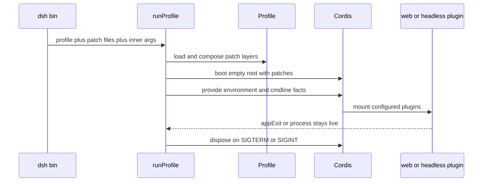

# CLI、Profile 与组合启动

`apps/cli/src/bin.ts` 是发布的 `dsh` bin（`apps/cli/package.json` 的 `bin.dsh`）。`parseDshArgs()` 先把调用归为 `profile`、`plugin` 或 `dump-config`；只有 profile 模式会动态导入 `runProfile()`。这样 `--help`、版本、插件管理和配置导出不会装载无关应用。

## 组装和生命周期

图示为 `apps/cli/src/profile-boot.ts` 的启动及关闭所有权。

`runProfile()` 在任何 Loader 条目挂载前提供冻结的启动环境和 `ctx.cmdlineArgs`；应用插件不能重新解析进程参数。它安装 fail-loud 处理器；`SIGTERM` 以 0 关闭、`SIGINT` 以 130 关闭，均通过根 fiber disposal 收束。成功 boot 后，会监听 profile 与 home 的用户 patch；若组合未提供 HMR/timer，则仅为配置热更新补装它们。

组合根永远是一个空的 `cordis.yml`：每次启动重写它，避免 Loader 写回把上次的插入行固化后在下次重复插入。详细 patch、双锚点解析和状态文件边界见[配置与状态来源](configuration-and-state-sources.md)。

## 参数边界、patch 顺序与信号

`parseDshArgs()` 将 `--profile`、可重复 `--patch`、dump、`web` alias 和 `plugin` 转发分开；第一个未知 token 是应用 inner args 的边界，launcher 之后不再重解释。`--dump-config`/`--dump-default-config` 互斥；dump 拒绝 app 参数，default dump 还限制 overlay，避免输出看似可运行但实际混有 invocation 的树。实际 patch 顺序是 bundle manifest layers → profile patch → home patch → argv `--patch`（按出现顺序）→ shipped preset-root patch → launcher-derived telemetry patch。`DSH_TELEMETRY_DISABLED` 只要非空就请求 hard-disable；组合中没有 telemetry row 时不凭空创建行。

`runProfile()` 在 boot 完成前即接管 `SIGTERM`/`SIGINT`，使启动窗口也走同一 disposal：前者以 0、后者以 130 结束。watcher setup 的失败只在明确的 teardown/abort 条件下抑制；其余配置读取或重组错误 fail loud，不能因为监听器未完成就继续运行半组装树。参数契约的 focused 证据在 `apps/cli/tests/args.spec.ts`。

## 交付表层

- `@deepseek-ai/dsh-base` 的 `cordis.patch.yml` 是所有 profile 的基础能力层：模型、工具、持久化、策略、设置、凭据与遥测。
- `@deepseek-ai/dsh-web-app` 在 base 上加入 HTTP、Remote 网关、浏览器模块和 `web-runtime`；其 startup 解析 `--host`、`--port`、`--trusted-host`，且拒绝 `0.0.0.0`。
- `@deepseek-ai/dsh-headless` 不装 Host/HTTP/UI。其 runner 创建新 agent、提交一个任务、flush 会话、打印该区间最后非空助手文本，并通过 `ctx.appExit` 退出。

Profile 层中替换某行的 `config` 是整项替换而非深合并；覆盖时必须重述须保留字段。`DSH_TELEMETRY_DISABLED` 只要为非空，就在存在 telemetry 行时追加禁用 patch。

## 修改路线与验证

| 意图 | 入口与相邻所有者 | 聚焦检查 |
|---|---|---|
| 增加 CLI 模式或参数 | `apps/cli/src/args.ts`、`bin.ts`、对应 startup provider | `pnpm vitest run apps/cli/tests` |
| 调整 profile 装配/关闭 | `apps/cli/src/profile-boot.ts`、`packages/boot/app-boot/src/profile.ts` | `pnpm vitest run apps/cli/tests packages/boot` |
| 改 bundle 行 | `packages/bundle/*/cordis.patch.yml` 与 bundle tests | `pnpm vitest run packages/bundle` |

不要让 app 插件直接读取可变 `process.argv` 或绕过 `ctx.appExit`；这会破坏 launcher 所拥有的可测试生命周期。