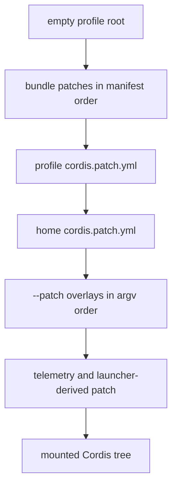

# Profile、配置层与本地状态来源

该页是所有「配置为什么生效」问题的规范归宿。启动顺序由[CLI、Profile 与组合启动](boot.md)执行；能力插件不得自创与此冲突的状态来源。

## Profile 与 patch 优先级

`packages/boot/app-boot/src/profile.ts` 将 profile 放在 `$DSH_HOME/profiles/<name>`：`package.json` 的 `dsh.profile.bundles` 定义有序 bundle，`cordis.patch.yml` 是 profile 自己的层。bundle 的 manifest 通过 `dsh.bundle.patch` 指向 patch。

解析 bundle 使用两个锚点：先从 `dsh` 安装的 `package.json` 解析，再从 profile 的 `package.json` 解析。因此随发行版的 bundle 总来自当前安装，而树外插件可由 profile 自己的 `node_modules` 提供。安装器维护 `$DSH_HOME/profiles/node_modules` 的扁平 symlink fallback，供 profile 按 Node 父目录查找规则解析内置闭包与 peer service definitions。

图示为 `apps/cli/src/profile-boot.ts` 中实际应用顺序。patch 通过 id 替换整行 config；不存在深合并。用户层热更新时，bundle 固定在底部、overlay 固定在顶部，且每一代 structured clone patch，避免 Loader 原地修改 insert 对象污染下一次重组。存在但无法读取、解析或不是 patch 数组的文件必须失败，不能静默忽略。

## 环境、Settings 与 Credentials 不是同一存储

| 来源 | 所有者/路径 | 读写与优先级 | 关键不变量 |
|---|---|---|---|
| 启动环境 | launcher 的 `loadLayeredEnv('dsh')` | 启动前快照，经 `DSH_LAUNCH_ENVIRONMENT_KEY` 提供 | 插件看到同一不可变 provenance；不是可写设置库。 |
| Settings | `dsh-settings-file`，默认 `$DSH_HOME/settings.yaml` | YAML/YML/JSON；一个文档承载 namespace；可写、可 watch | 交叉进程锁 + 原子写；reload/write 串行；无效既存文档 fail loud。 |
| Credentials | `dsh-credentials-local`，默认 `$DSH_HOME/.credentials.yaml` | process env > managed credential file > cwd `.env` > home `.env` | 只存 `CredentialRef → 非空 string`；诊断不回显值；POSIX 文件对 group/other 可读即拒绝。 |

Settings 修改采用叶级 comment-preserving diff；不同 namespace 仍串行，避免互相覆盖。Credentials 写入在锁内重读并只改自己的键，外部编辑会整体替换内存快照；继承环境是只读且优先，UI 写入不能伪装为覆盖它。两者 watcher 都有 settle 窗口，dispose 后拒绝新事件。

**密钥规则：** 只传播 credential reference、来源状态或脱敏错误；不得把 credential 值记录到日志、session、错误、生成配置或浏览器 Remote。`.env` 仅为只读 fallback，不是 Harness 管理的 credential store。

## 修改路线与验证

- Profile 发现、安装 fallback、manifest 校验：`packages/boot/app-boot/src/profile.ts`；测试 `packages/boot/app-boot/tests/user-patches.spec.ts`。
- 启动层和热更新：`apps/cli/src/profile-boot.ts`、`apps/cli/tests`。
- 设置：`packages/settings/settings-file/src/index.ts`；凭据：`packages/credentials/credentials-local/src/index.ts`。修改写入/监听需验证锁、原子性、解析失败和 dispose 行为。
- 真实 provider 需要凭据的 e2e 是条件性检查；常规修改优先运行对应 package Vitest，再按[构建与测试](../engineering/build-and-test.md)选择门禁。