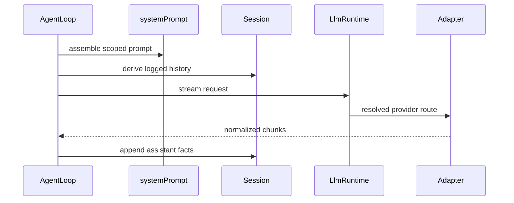

# LLM、提示词与运行时上下文

`packages/llm/llm/src/index.ts` 的 `LlmRuntime` 是 `ctx.llm`：provider adapter 注册在这里，`AgentLoop` 经 `llm/stream` waterfall 请求模型。`core/system-prompt` 的 `ctx.systemPrompt` 则把身份、persona、动态 context 和工具 schema 组装为请求；两者通过 `AgentLoop` 汇合，不能由 UI 或 provider 直接拼接另一份模型历史。

图示是一次模型步骤的输入和输出所有权：提示词与历史在调用前形成，流式结果必须先归一化再成为会话事实。

## Adapter seam 与调用契约

- `LlmAdapter` 的必需实现是 `stream(options)`；通过 `ctx.llm.registerAdapter()` 注册 provider route。`llm-deepseek` 直接处理 DeepSeek wire/SSE，`llm-pi-ai` 适配 pi-ai catalog、discovery、replay 与流；`llm-retry` 和 `token-meter` 是围绕公共 seam 的策略插件。
- route 注册是原子替换：`AdapterRegistrationHandle.replace()` 先整体校验，冲突/无效输入不留 route 缺口。consumer 只用 provider id 和 `LlmRuntime`，不可 import 某一 adapter。
- `llm/stream` 是 waterfall；监听器要 `next()`，或交付自己的 chunk 流以短路。由 loop 构造的请求带进程内标记且 deep-frozen，监听器只可观察、重放、路由或重试，不得改写其从 session 重建的内容。
- provider 必须尊重 `options.signal`，并将 provider failure 规约为 `LlmError`/`LlmFailure` 的稳定 code。API key 经 `assertUsableApiKey()` 校验，诊断只含 credential reference，绝不回显值。

## 提示词、工具与 durable context

`SystemPrompt` 以 name 去重注册 section、context、tool provider 和变量。section 按 `order` 排列；`deployment:persona` 是可被 scoped persona 覆盖的稳定槽；`complete` section 仍允许工具/context 完成组装，但最终是唯一系统提示词。`toolOrder` 必须含 `<unlisted-tools>`，未知配置名在组装时报错，确保跨机器排序和工具目录可重现。

动态 context 由 `renderContextSnapshot()` 形成用户角色快照。AgentLoop 将其写入 session 后才交给模型，因此“模型可见即已记录”仍成立。`context/agent-instructions` 是典型 provider：启动时通过 `ctx.fs` 读取 AGENTS.md 兼容文件，成功的 read/write/edit 工具触达会触发嵌套指令 reconciliation；异步投影要等 step 和执行祖先边界，卸载时 abort 自己的投影工作。`session-reference`、`time-context`、`tmux-context` 也只应通过 prompt/context seam 增加可见事实。

## 流组装与重试恢复

`BlockAssembler.push()` 接收 `block-start`、文本/推理/tool-call delta、`block-end`、`usage` 与 `finish`，并维护 partial block。没有显式边界的 delta 会按类型形成隐式块；最终 blocks 按流中首次出现顺序输出。`block-end` 为权威闭合且 first-close-wins：重复 close 和 close 后迟到 delta 都被忽略，避免迟到 tool-call 参数改变将执行的调用。`assemble()` 为未闭合 text/reasoning/tool-call 生成最终 block，工具调用缺少 id/name 使用受控回退；`finish.kind === 'max-tokens'` 时滤除 tool-call block，避免执行截断调用。缺少 finish/usage 使用默认值；未知未关闭 block 或未知 chunk 类型显式失败。

`resolveRetryPolicy()` 校验未知字段、次数/延迟上限和重复 code 后返回冻结策略。省略配置即 normal：默认 `maxRetries` 为 2，默认可重试 code 是 `EMPTY_RESPONSE`、`RATE_LIMIT`、`SERVER`、`TIMEOUT`、`TRANSPORT`；本地 backoff 默认初始 500 ms、最大 10,000 ms、对称 jitter ratio 0.1，且 initial 不得大于 max、jitter 必在 0 到 1。normal 只在 failure code 匹配且历史同策略 retry 未超过 `maxRetries` 时尝试恢复，always 不受该 failure-code gate 限制。`llm-retry` 从 session 日志恢复 retry number/id，优先采用受上限约束的 `providerRetryAfterMs`，否则用本地指数退避/jitter；它必须在可取消等待前追加 `llm/retry`、等待完成后才追加 `llm/retry-started`。agent signal 或 plugin disposal 取消等待并 drain active recovery；下游 recovery 的失败不被吞没。

聚焦证据：`packages/llm/llm/tests/assembler.spec.ts` 覆盖交错、delta-only、duplicate close、late delta 与 max-token；`packages/llm/llm-retry/tests/retry.spec.ts` 覆盖 provider 路由、retry event、延迟、取消与恢复。

## 修改面与验证

| 改动 | 同时检查 | 聚焦验证 |
|---|---|---|
| 新模型 provider | adapter、exports、bundle registration、credential ref、一个 consumer request | `pnpm vitest run packages/llm` |
| 流、错误或 retry | `LlmRuntime`、chunk assembler、agent-loop 调用方、adapter failure tests | `pnpm vitest run packages/llm packages/core/agent-loop` |
| 新 prompt/context | `SystemPrompt` provider、对应 `SessionEventMap`/投影、scoped consumer | `pnpm vitest run packages/core/system-prompt packages/context packages/core/agent-loop` |

不要把 context 只保存在 provider 内存中，也不要把 provider-specific wire 类型泄露给工具、session 或 Client。