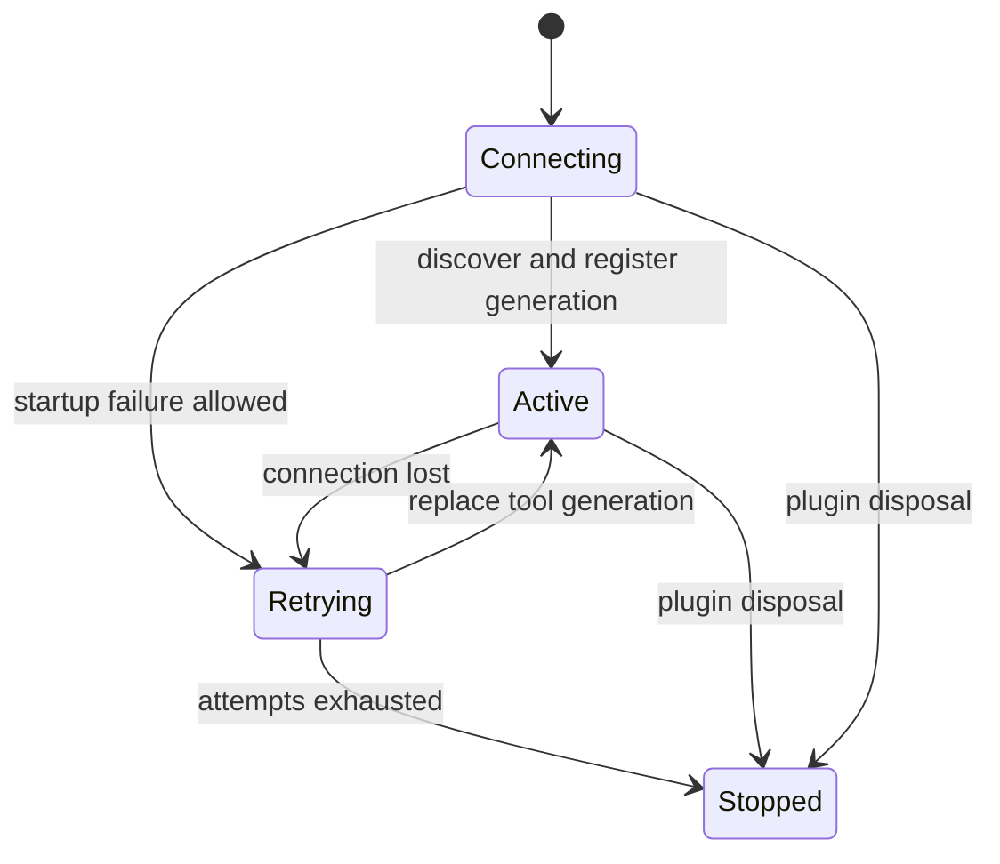

# MCP Client 的连接与工具代际

`packages/mcp/mcp-client/src/index.ts` 将一个外部 MCP server 映射为一个 Cordis plugin instance。它注入 `ctx.tools`，每台 server 的工具公开名固定为 `mcp__<serverName>__<rawName>`；要接多台 server，应在 `cordis.yml` 装载多个 instance，而不是让一个 instance 隐式复用连接。

## 配置与所有权

支持两种 transport：

- `stdio`：`command`、直接 argv `args`、额外 `env` 和 `cwd`，不经 shell 插值。
- `streamable-http`：URL 与请求 headers。

`serverName` 必须匹配 `[A-Za-z0-9_-]{1,32}`，且由 `activeServerNames` 在同一 `ctx.root` 保留。重复在加载期失败，只有 disposer 释放保留；工具名因此不会 shadow。每调用 `toolCallTimeoutMs` 默认 60 秒；reconnect 参数也在 config 边界校验。`failOnStartupError` 为 true 时，初连或首次工具同步失败会回滚 fiber；false 则记录错误、保留 supervisor 并进入 reconnect。stdio 必填 command（argv 直接传递），streamable-http 必填 URL；二者的 env/headers 只走各自 transport 配置。

图示概括 `startConnection()` 所管理的 client/transport/tool generation。连接代际切换前必须撤销旧工具；重连具有有限退避，不能产生重叠服务进程或让旧 generation 复活。plugin dispose 停止重连、等待在飞调用收束、断连、注销当前工具并释放 namespace reservation；HMR 用同一过程 hot-swap，因此同名 server 重新得到相同公开工具名。

## 改动面与验证

实现入口：`packages/mcp/mcp-client/src/index.ts`、`connection.ts`、`tools.ts`。修改 transport、重连或注册策略时必须保持 tool registry 与[工具执行授权](tool-execution-and-authorization.md)的 schema/cancel 合同。重点测试为 `tests/reconnect.spec.ts`（generation-safe 重注册、退避、无重叠和 dispose）、`mcp-client.spec.ts`、`apply.spec.ts` 与 `mcp-client.e2e.ts`。

聚焦命令：`pnpm vitest run packages/mcp/mcp-client`。