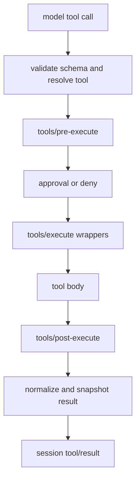

# 工具执行、授权与受限副作用

`packages/core/tools/src/index.ts` 的 `ToolRuntime` 是 `ctx.tools`。工具定义包含输入 schema、强制的 canonical JSON output/schema 和 `execute(args, exec)`；registry 在工具体前后拥有结果规范化、模型内容渲染、日志快照和 UI presentation。工具实现只能返回自己的 canonical value，不能自行伪造 `tool/result`。

图示为工具 registry 的 guard/around/post 管线；每个 waterfall 及其取消契约由 `dsh-tools` 声明。

## 授权、并发与取消

`tools/pre-execute` 可 allow、deny 或 ask；没有 approval service 时 ask 视为拒绝。`tools/execute` 可安装 timeout/retry/metrics wrapper，但 wrapper 只能替换 `exec.signal`，registry 会重新融合调用者 signal。实现必须观察该 signal，并在返回前让自有异步工作达到 quiescence；同进程 JS 无法被硬杀。

只有 `isConcurrencySafe(args) === true` 的调用能进入 parallel group；否则为 exclusive barrier。并发工具不得变更不耐竞争的父状态。`timeoutMs` 是协作式预算，永不暴露给模型。大结果的 durable log copy 可由 spill policy 在 `tools/code-dispatch-log` 变为预览加 locator；程序原值和模型可见文本是不同表面。

## Capability seam 与执行链

工具通常是 consumer，而 service definition/provider 可替换：

| 领域 | Definition / provider / consumer 代表 | 修改约束 |
|---|---|---|
| 文件 | `dsh-fs` / `fs-local`、`fs-sandbox` / `tool-fs`、`tool-fs-search`、editor | 文件策略用 `fs/*` seam；不要让工具绕过 `ctx.fs`。 |
| shell 与进程 | `dsh-shell`、`dsh-subprocess` / local、sandbox provider / bash、pwsh、terminal tools | argv 直接传递，消费者先请求 confinement；进程的实际效果由 sandbox policy 决定。 |
| 审批 | `dsh-user-approval`、permission presets / ask-user 等工具 | 一个请求是一次性决定，不得从未知客户端响应推导永久授权。 |
| sandbox | `dsh-sandbox` / `sandbox-local` + policy | 无可用 confinement 时 fail closed；平台含义见[Sandbox 与原生 runner](../platform/sandbox-and-native-runners.md)。 |
| 网络/LLM/检索 | `llm`、`web`、`mcp-client` providers / tool consumers | provider 与 consumer 依赖 definition，不依赖具体实现。 |

完整 service/provider/consumer 图见[能力 seam](../capabilities/seams.md)；MCP 连接与代际工具注册见[MCP Client](mcp-client.md)。

## 验证

修改 registry 时运行 `pnpm vitest run packages/core/tools packages/interaction/user-approval packages/guard`。修改 FS、shell、sandbox 时同时运行对应 provider/tool tests；涉及真实隔离时再按平台运行 e2e。