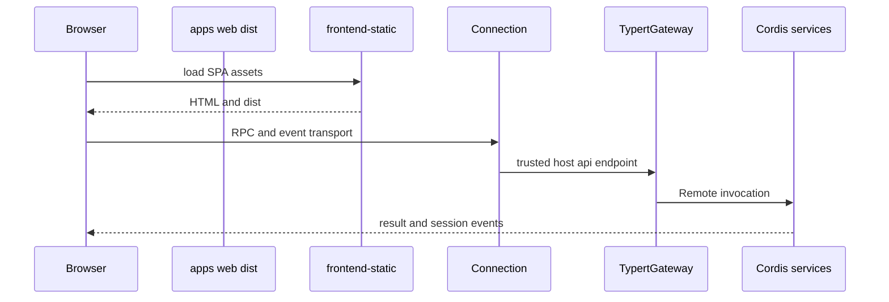

# Web 应用、Host、Client 与远程调用

`apps/web/src/main.ts` 仅定位 `#root` 并运行 `new AppWebEntry(el).run()`；shell、模块表、AppRoot gate 与 React 组装属于 `@deepseek-ai/dsh-client-web`。生产 `dist` 由 Vite 构建，`dsh web` 的 `dsh-web-app` bundle 解析并由 Host 静态服务交付；没有源码服务 fallback。

图示为 Host/Client 的运行时边界；RPC 校验、authority 与取消在[Typert Gateway 与 Connection](../integration/typert-gateway-and-connection.md)。

## 组合责任

- `dsh-web-app/cordis.patch.yml` 在 base 之上插入 webserver、gateway、workspace、projection cache、storage、浏览器模块和 HMR 链；`web-runtime` 解析前端 dist、提供 URL/trusted host 信息，并在 `surfaceContext` 时注册 Web 相关提示词和 `DSH_WEB_URL`。
- Host：`host/webserver` 提供路由载体；`frontend-static` 占据 SPA fallback；`host/apiproxy` 是旧 API；`api/gateway` 是 Typert Remote dispatcher；`host/plugin-inventory` 为只读 inventory Remote。
- Client：`connection` 维持 RPC/事件；`runtime` 提供 session/workspace/UI 服务；`modules`/`web-react` 装配 React。`ui-conversation`、`ui-sidebar`、`ui-tool`、settings、plan、goal、workflow 等是独立 feature plugins，通过 `ui-slots` 扩展。

Host/Client 是两个 TypeScript aggregate，因为二者对 Cordis `Context` 的相同 key 声明可不同；构建边界见[构建与测试](../engineering/build-and-test.md)。浏览器可信 host 与端口参数、以及本地 settings/credentials 的来源见[配置与状态来源](../runtime/configuration-and-state-sources.md)。

## 验证

改 Vite entry 或 UI：`pnpm --filter @deepseek-ai/dsh-web-frontend run build`，再运行相关 `apps/web/tests` 或 `packages/client` tests。改 Host 路由/RPC：运行 `packages/host`、`packages/api`、`packages/client/connection` tests。需要 built bundle 的 web 测试使用 `pnpm run test:web:built`。