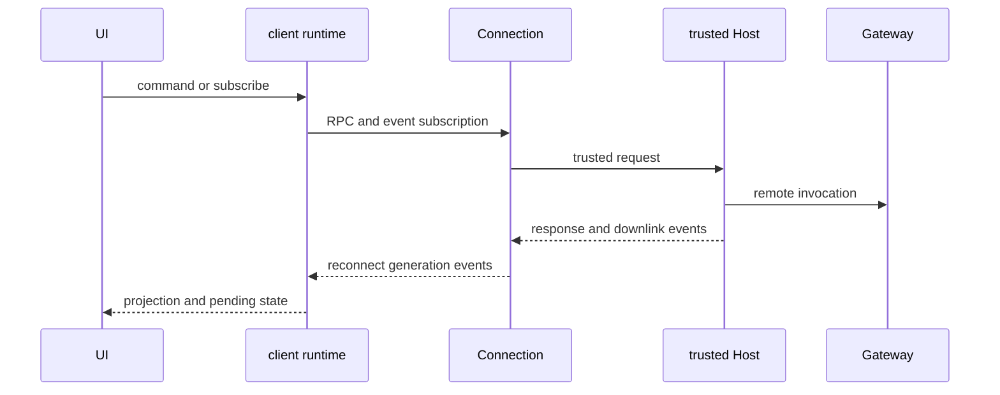

# Client Runtime、Connection 与会话呈现

[Typert、Gateway 与 Connection](../integration/typert-gateway-and-connection.md)定义 Host `/api` 的 descriptor/codec/authority；本页定义浏览器半边：`client/connection` 负责可信 transport，`client/runtime` 将 RPC 和 event downlink 变为可渲染但可替换的本地状态。UI feature plugin 只消费 runtime service/slots，不应自己维护第二套 session log。

图示分别标明 Host RPC authority 与 Client state ownership。

## Connection：传输与 trust

`packages/client/connection/src/index.ts` 提供 RPC/host/client halves。`api-request-trust.ts`、`api-path.ts` 与 loopback hostname 规则限制请求只能到可信 Host；`http-bridge.ts` 处理 body size、断连 abort 和 SSE backpressure；`websocket-downlink.ts` 负责事件下行与连接代际。取消、transport close、错误 payload 都要结束其对应 waiter，不能因为 reconnect 让旧 generation 的响应写入新 state。Host 端 `/api` endpoint 校验仍归 Gateway，而不是浏览器猜测。

## API 信任与单向下行

`isTrustedApiRequest()` 在 Host fence 同时检查 Host、Fetch Metadata 与 Origin：loopback 或配置 `trustedHosts` 可作为 authority；带端口 entry 仅匹配该端口，无端口 entry 按规范 authority 规则匹配。缺 Host、cross-site/DNS rebinding 或无法验证的 Origin 均拒绝；opaque `null` origin 不是自动信任。`assertTrustedAuthority()` 只接受 bare `host[:port]`，拒绝 URL parser 会悄悄重解释的 scheme/path/userinfo 等配置。

`WebSocketDownlinks` 为 mux 与 host stream 分别建立独立 socket，并包装为 `server-request`。它是单向下行：client WebSocket message 立即以 1008 关闭。socket close/error、Host close 或 source `AsyncIterable` 抛错会 abort pump；source failure 会发送 `stream/error` 后终止 socket，Host disposal 等待 pump 收束。聚焦证据：`packages/client/connection/tests/api-request-trust.host.spec.ts`（rebind、端口、Origin、规范化）与 `websocket-downlink.host.spec.ts`（双 downlink、1008、source failure）。

## Runtime：投影、队列和树

`client/runtime/src/client/sessions/manager.ts` 的 session manager 拥有已实例化与尚未实例化 session 的 request/queue snapshot、projection 更新、连接 generation、subagent catalog。`projection-store`、`queue-mirror`、`pending` 和 `partial` 维护可回答请求与 partial state；`conversation-assembler`/`conversation` 将事件转换为 UI nodes；`lineage`、`subagent-lineage`、`tool-call-tree` 表示 parent/child 与工具树。它们都是日志/remote event 的浏览器 projection，不能反向伪造 durable session fact。

卸载/HMR 时应解除 subscription、拒绝旧 generation 更新、保留或丢弃 local pending state 必须由 runtime owner 明确决定。`ui-conversation`、sidebar、tool、goal/plan/workflow 等 feature plugins 通过 modules、runtime 和 `ui-slots` 扩展呈现，不拥有 transport 或 event replay。

## 修改与验证

| 改动 | 同时检查 | 聚焦验证 |
|---|---|---|
| RPC/downlink | trust/path、abort、SSE/WebSocket reconnect、Gateway contract | `pnpm vitest run packages/client/connection packages/api` |
| session presentation | manager、projection/queue/partial、lineage/tool tree、UI consumer | `pnpm vitest run packages/client/runtime packages/client` |
| UI feature | 对应 `ui-*` plugin、slot registration、runtime contract | 相关 package Vitest；built bundle 时 `pnpm run test:web:built` |

重点测试可信 host、oversize/断连、旧 generation、未实例化 session queue、投影重连、preset 更新和 scope teardown。